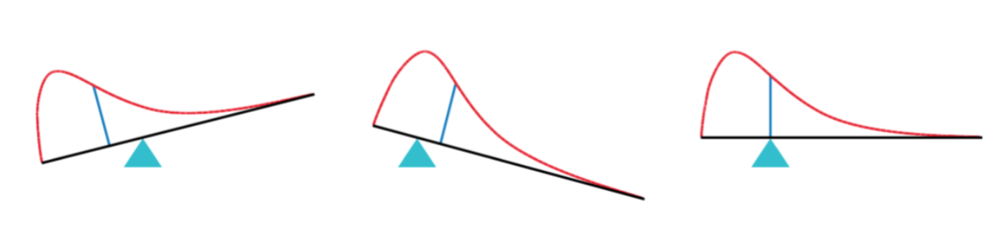
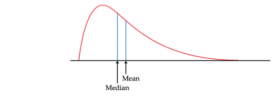
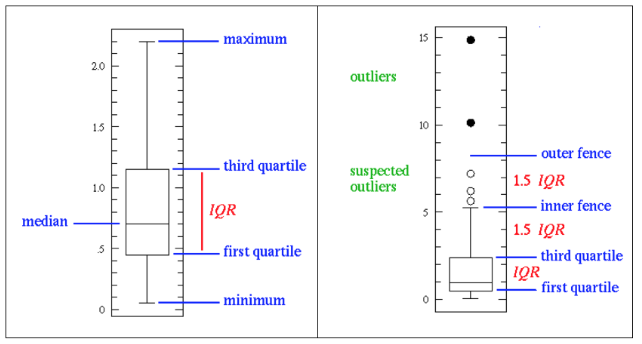

# Fundamentals of Statistics

```{r setup, include=FALSE}
library(DiagrammeR)
library(DT)
#library(editR)
knitr::opts_chunk$set(echo = TRUE)
```


## Why Studying Statistics

1. teaching, research, practicum
    - a prerequisite for more courses
    - a prerequisite for research
    - a prerequisite for working on practical projects
2. summer internships
3. diversified career prospects
    - data analyst
    - statistician
    - machine learning scientist
    - data scientist

```{r, echo=FALSE}
mermaid("
graph LR
DA(Data Analyst) --> Stats(Statistician)
Stats --> DS(Data Scientist)
DA --> DS
DA --> ML(Machine Learning Scientist)
ML --> DS
", height=150)
```

4. K-12 content-wise education revolution 
    - teach useful things
        - study-load reduction
        - happy learning
    - don't teach unless you've used it
5. preparation for studying abroad
    - open your eyes and see for yourself 
    - leave the door open (just in case) 
6. understanding and changing the world
    - understanding precedes effecting changes
    - description leads to understanding
    - changing the world starts with getting accurate descriptions of it
    - e.g., regular expression or exorcism

### Understanding the World

- Subject
    - nature
    - human society
- Methodology
    - the scientific method: observe-hypothesize-verify
- Tools
    - languages
        - natural languages
        - mathematical languages, e.g., Calculus, Probability & Statistics
        - computer langages
    - concepts & models

Equipped with the scientific method, social sciences have eventually chipped off the humanities and have evolved into stand-alone disciplines in their own right. Statistics plays a central role in the process. If Calculus is the mathematical language for describing the natural world, Statistics is the language for describing human societies. In college, you should not only learn the knowledge, but also the methods and tools begetting the knowledge.

```{r, echo=FALSE}
mermaid("
graph LR

Sci(Science) --> N(Nature)
N --> NS(Natural Sciences)
Sci --> S(Society)
S --> SS(Social Sciences)
S --> H(Humanities)

NS --> Phys(Physics)
NS --> Chem(Chemistry)
NS --> Bio(Biology)
SS --> Soc(Sociology)
SS --> Edu(Education)
SS --> Psy(Psychology)
SS --> Econ(Economy)
SS --> Pol(Political Science)

H --> L(Literature)
H --> A(Arts)
H --> Hist(History)
H --> Phi(Philosophy)
", height=650)
```

### Science vs. Philosophy

```{r, include=FALSE}
mermaid("
graph BT
A(World = Nature + Human Society) --> B(Thoughts)
B --> C(Philosophy)
A --> E(Science)
E --> D(Faith)
B --> D

")
```


## The Big Picture

### Central Themes in Statistics

- Deterministric vs. Stochastic
    - **goal**: understand your **_fate_**
    - e.g., Gaokao score on mathematics
    - **goal**: reduce randomness to increase the deterministric part
    - e.g., use "School Status" or "IQ" to predict your fate 

- Signal vs. Noise
    - **question**: do I only need to care about **_fate_** and disregard **_luck_** completely?
    - e.g., results of two experimental setups
    - **goal**: construct a ratio to consider **_fate_** and **_luck_** simultaneously


## The Fundamentals of Statistics

### Storing Data in Tables

There are many ways to store data (e.g., csv files, SQL files, json files, XML files). For data analysis in particular, the predominant method is to store data in a tabular form.

- rows vs. columns (common sense & linear algebra) 
- cases vs. variables (statistics) 
- examples vs. features (machine learning) 
- a specific data point is called an entry, an element, a field 

The following is the first rows of the famous `iris` dataset. 


```{r, echo=FALSE}
DT::datatable(data.frame(ID=1:nrow(iris), iris),
          rownames=FALSE,
          caption="Table 1: This is the famous iris dataset."
          )
```


### Variable Types

Three major data types:

> **_nominal_** variable < **_ordinal_** variable < **_interval_** variable

| Variable Type | Type | Treatment | Examples |
|:---|:---|:---|:---|
| dummy | categorical | dummy | gender |
| nominal | categorical | dummy | city |
| ordinal | categorical | nominal or continuous|education level |
| interval | continuous | continuous | temperature in Celsius |
| ratio | continuous | continuous | temperature in Kelvin |
| | | | |

- For categorical variables, i.e., nominal and ordinal variables, each unique value is called a **_level_**.
- **dummy** variable: A dummy variable, a.k.a. **_dichotomous_** or **_indicator_** variable, is a special kind of normal variable with only two levels, e.g., gender (male vs. female).
- **nominal** variable: In practical data analysis, a **_nominal_** variable is converted into a set of dummy variables.
- **ordinal** variable: An **_ordinal_** variable is treated either as a nominal or a continuous variable. 
- **interval** variable: An interval variable is a measurement where the difference between two values is meaningful. 
- **ratio** variable: A interval variable is a special kind of ordinal variable, where 0 actually means zero or none or nothing. 
- Eventually, the resulting data matrix is composed of dummies and continuous variables only.
- Categorical variables are also called **_discrete_** variables. Continuous variables, i.e., interval and ratio variables, are called **_quantitative_** variables. 


### Exploratory Data Analysis: Checking Distributions

<!-- |Variable Type|Summary Statistics|Graphs| -->
<!-- |:--- |:--- |:--- | -->
<!-- | categorical variable | frequency table | bar-graph | -->
<!-- | | | pie-chart | -->
<!-- | continuous variable | (1) center | histogram | -->
<!-- | | mean | density curve | -->
<!-- | | median | box plot | -->
<!-- | | (2) spread | | -->
<!-- | | variance | | -->
<!-- | | standard deviation | | -->
<!-- | | range | | -->
<!-- | | IQR | | -->
<!-- | | (3) shape | | -->
<!-- | | modality | | -->
<!-- | | skewedness | | -->
<!-- | | kurtosis | | -->
<!-- | | | | -->


```{r, echo=FALSE}
knitr::asis_output(htmltools::htmlPreserve("
<table>
<tbody>
  <tr>
    <th>Variable Type</th>
    <th>Summary Statistics</th>
    <th>Graphs</th>
  </tr>
  <tr>
    <td>categorical variable</td>
    <td align='center'>frequency table</td>
    <td> <ul><li>bargraph</li><li>pie chart</li></ul> </td>
  </tr>
    <td>categorical variable</td>
    <td><ol>
        <li><strong>center</strong></li>
          <ul><li>mean</li>
              <li>median</li></ul>
        <li><strong>spread</strong></li>
          <ul><li>variance</li>
              <li>standard deviation</li>
              <li>range</li>
              <li>IQR</li></ul>
        <li><strong>shape</strong></li>
          <ul><li>modality (unimodal vs. multi-modal)</li>
              <li>skewedness (symmetric vs. skewed)</li>
              <li>kurtosis</li></ul>
    </td>
    <td> <ul><li>histogram</li><li>density curve</li><li>box plot</li> </td>
</tbody>
</table>
"))
```

#### Statistic vs. Statistics

The plural form of **_statistic_** is **_statistics_**. So the study of statistics is statistics.

Why do we need any statistics? Because we need to summarize a load of data efficiently. 

- In the context of statistics, a statistic is a summary of some aspect of a sample of data. 
- In daily usage, a statistic is an event or person regarded as no more than a piece of data. 

#### Mean vs. Median

$$ m = \frac{1}{n} \sum_{i=1}^n x_i$$
By convention, we usually use $m$ to represent sample mean. Don't mind the word _sample_ for now; focus on the word _mean_.

```{r}
# Let's create some data
samp1 = c(1, 2, 5, 8, 10)
samp2 = c(1, 2, 5, 8, 100)
samp3 = c(1, 2, 5, 8, 10, 100)
```

```{r}
# compute the means
c(mean(samp1), mean(samp2), mean(samp3))

# compute the medians
c(median(samp1), median(samp2), median(samp3))
```

- mean
    - easy to compute
    - but sensitive to outliers
    - has nice mathematical properties
- median
    - harder to compute
    - insensitive to outliers
    - has nice mathematical properties of a different kind


#### Variance & Standard Deviations

If the average of $x_i$ is the mean, then what is the aveage of $(x_i-m)$ and $(x_i-m)^2$?

1. $E(X) = \bar{X}$
2. $E(X - \bar{X}) = E(X) - E(\bar{X}) = \bar{X} - \bar{X} = 0$

On average, if there is a data point at some distance away from the mean to the right, there is as if another data point of the same distance from the mean lying on the left. Image a seesaw, where data points are of the same weights but lying at different positions specified by their values. Mean is the balancing point. 




Since mean is sensitive to outliers and median is not, logic dictates that



3. Let $E(X-c)^2 = Q1$ where $c$ is a constant. Q1 will reach its smallest possible value when $c$ equals the mean. In other words, **_mean_** is the value that makes the average of the **_squared distances_** the smallest. 

4. Let $E(|X-c|) = Q2$ where $c$ is a constant. Q2 will reach its smallest possible value when $c$ equals the median In other words, **_median_** is the value that makes the average of the **_absolute distances_** the smallest. 


> Questions: Is variance sensitive to outliers?


#### Quartiles and Percentiles

Since a quarter is 1/4 or 25%, 

- The **_first quartiles_** is also called the **_25th percentile_**
- The **_second quartiles_** is also called the **_50th percentile_** (a.k.a. median)
- The **_third quartiles_** is also called the **_75th percentile_**

**_IQR_** = **_interquartile range_** = 3rd quartile - 1st quartile

**_Five-number Summary_**  is (1) the minimum, (2) 1st quartiles, (3) median, (4) 3rd quartile, and (5) the maximum

`NOTE`: In R, `quantile()` is the command for getting percentiles. But why does R use the word **quantile** instead **percentile**? I would really hate to say that **percentile** and **quantile** mean exactly the same thing in HERE. However, they are two completely different concepts when used in the context of probability functions, which we will discuss below with normal distributions. That being said, **quantile** is a more apt term in that context, and R are using the two terms consistently. But other sources, e.g. textbooks, might use them interchangably. As a result, you will have to rely on context to decide whether they mean the same thing or not. 


#### Inner Fences, Outer Fences, and Outliers

- **inner fences** span between **_1.5_** times the IQR above the 3rd quartile and below the 1st quartile. Data points lying beyond the inner fences are regarded as **_potential outliers_**. 
- **outer fences** span between **_3.0_** times the IQR above the 3rd quartile and below the 1st quartile. Data points lying beyond the outer fences are regarded as **_practically outliers_**. 



#### Skewness and Kurtosis

- **_skewness_** is a statistic that measures the amount of imbalance away from symmetry. A positive number indicates right-skewness (aka skewed to the right) with a long tail on the right and a negative number indicates left-skewness (aka skewed to the left) with a long tail on the left. 
    - average of $z^3$
    - skewness has no units
    - two tails cancel out
- **_kurtosis_** is a statistic that measures whether sample variability is a result of the presence of infrequent extreme deviations (e.g., outliers). The reference standard is a normal distribution, any of which has a kurtosis of 3. As a result, people usually use **_excess kurtosis_**, which is kurtosis - 3, and would simply refer to excess kurtosis as kurtosis. Hence, (excess) kurtosis > 0 means that the mass around the shoulders are shifted to the two tails and/or the center.  
    - average of $z^4$
    - kurtosis has no units
    - each tail contributes separately

[Understand Kurtosis - external link](https://brownmath.com/stat/shape.htm)


| situation | name | meaning |
|---|---|---|---|
| skewness > 0 | right-skewed | a long tail on the right |
| skewness < 0 | left-skewed | a long tail on the left |
| excess kurtosis > 0 | | shoulder mass shits to the tails and/or centers |
| excess kurtosis < 0 | | the opposite is true |
| | | |


> Question: What are the averages of z-score and z-score squared?

#### Effects of Linear Transformations

Given **x**, we have **y = a + bx**. How does this linear transformation affect measures on center, spread, and shape?

Change of **_units of measurement_**, e.g., from Celsius to Fahrenheit, is a typical example of a linear transformation. Multipling a **b** greater than 1 incrases disperstion (i.e., spread), while multipling a **b** less than 1 decreases dispersion. Adding an **a** to **bx** shifts **bx** by **a** without changing the dispersion. As a result, we have:

- Given the old mean **m**, the new mean changes to **a + bm**.
- Given the old standard deviation **s**, the new standard deviation changes to **bs**.
- Shape measures, e.g., skewness and kurtosis, would not change.

#### Standardization and Z-scores

Any continuous variable can be standardized by subtracting the mean and then divided by the standard deviaiton, i.e. $z = (x-m)/sd$. The resultant variable will always have $mean = 0$ and $sd = 1$. Since standardization is only a linear transformation, the shape of the variable does not change.  

Given $y = a + bx$, we have $m_y = a + b \cdot m_x$ and $sd_y = b \cdot sd_x$, we have

$$z_x = \frac{x - m_x}{sd_x}$$

and

$$z_y = \frac{y - m_y}{sd_y} = \frac{(a + bx) - (a + bm_x)}{b \cdot sd_x}
= \frac{x - m_x}{sd_x} = z_x$$

- We don't need to worry about units of measurement anymore.
- Different features are now somewhat comparable.
- We have some idea about SDs.


### Normal Distributions

Normal distributions and their close kin student _t_ distributions are the working horses of statistical inference. 

#### Normality Density Curves

The **_probability density function_** for _a normal distribution_ is 

$$f(x) = \frac{1}{\sigma \sqrt{2\pi}} e^{-\frac{1}{2} \left(\frac{x-\mu}{\sigma}\right)^2}$$
where $\mu$ is the **mean** and $\sigma$ is the **standard deviation**. Two parameters uniquesly define a normal distribution, denoted as $N(\mu, \sigma^2)$. 

- $\mu$ shifts the center of the curve
- $\sigma$ adjusts the spread of the curve

A **_probability density function_** (**PDF**) would produce a curve called a **_density curve_**. A **_probability (density) function_** is a very special function in that the total area under the density curve would always sum to 1 and hence the name **probability**. 


Given a **_probability density function_** (**PDF**), one needs to know how to do the followings in R.

```
density = dnorm(quantile, mean=0, sd=1)
percentile = pnorm(quantile, mean=0, sd=1)
quantile = qnorm(percentile, mean=0, sd=1)
data = rnorm(sample_size, mean=0, sd=1)
```

#### The 68-95-99.7 Rule

When $\mu = 0$ and $\sigma = 1$, we get **_the standard normal distribution_**. We know **everything** about the standard normal distribution. 

`NOTE`: There are an infinite number of normal distributions, each with a different $\mu$ and $\sigma$. However, there is only one **standard** normal distribution, called **the** standard normal distribution.


#### Normal Quantile Plot

Normal Quantile Plot (aka **QQ Plot**) is used to visually inspect how much a given distribution deviates from a normal distribution by comparing it against the standard normal distribution.	 	 	 		

1. Arrange the observed data values from smallest to largest. Record what percentile of the data each value occupies. For example, the smallest observation in a set of 20 is at the 5% point, the second smallest is at the 10% point, and so on. 
2. Do normal distribution calculations to find the z-scores corresponding to these same percentiles. For example, z = -1.645 is the 5% point of the standard normal distribution, and z = -1.282 is the 10% point. 
3. Plot each data point on the y axis against the corresponding z-score on the x axis. If the data distribution is close to any normal distribution, the plotted points will lie close to a straight line. 


