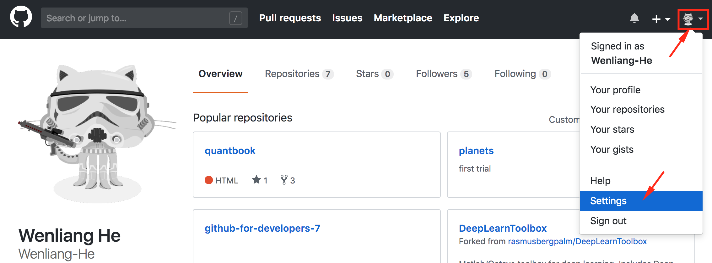
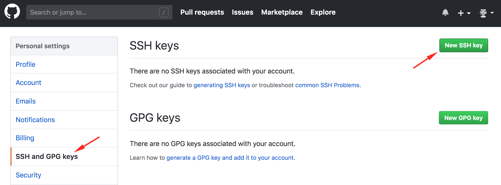
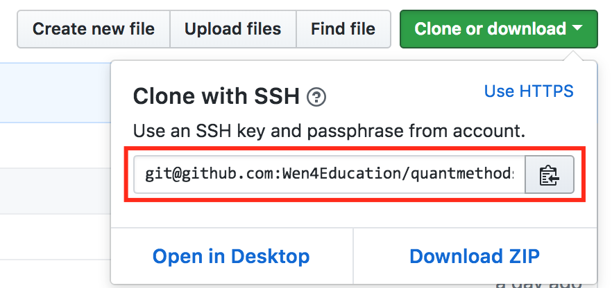

Before we start, make sure you have set your GitHub username and email properly by using `git config --global --list` to check it up. If you have multiple GitHub accounts, set them to your primary GitHub account (e.g., the account that you will use most frequently).  

If they are not set, do the following to set them up. 

```
$ git config --global user.name "username1"
$ git config --global user.email "user1@someorg.com"

```

### Generate SSH Keys

To start with, you need to generate a private-public key pair (i.e. two keys). 

1. Check to see if you already have any existing SSH keys

Use the following command to list out all existing key pairs if present. 

```
$ ls ~/.ssh

```

You will encounter one of the three scenarios. 

- **Error Message**

If you see the following error message, it means that you have no keys (in fact, you don't even have the folder that contains the keys). 

```
ls: .ssh: No such file or directory

``` 

You will then (a) create the `.ssh` folder, (b) go into it, and (c) go directly to step 2.  

```
$ mkdir ~/.ssh   # create the folder
$ cd ~/.ssh      # go into it

```

- **Nothing**

If you see nothing (no error message, no contents; as if nothing happens), it means you have the `.ssh` folder, but nothing is in it. 

In this case, (a) go into the `.ssh` folder, and (b) go directly to step 2.

```
$ cd ~/.ssh      # go into it

```

- **Some Files**

Otherwise, you may see some files that look similar to `id_rsa` and `id_rsa.pub`. Don't worry if you don't have the `config` and `known_hosts` files. 

```
config    id_rsa    id_rsa.pub  known_hosts

```

At this point, you can choose to (a) use any existing key pairs (skip step 2 and jumpt directly to [Add Public Key to GitHub]) or (b)create new ones (go to step 2). Either way, you need to go into the `.ssh` folder before moving on. 

```
cd ~/.ssh        # go into it

```


2. Generate a new private-public key pair

Let us create a new pair of keys named `newkey1` and `newkey1.pub`, where the first one is a private key and the second one is a public key (and hence the `.pub` extension). 

`NOTE`: You don't have to call it `newkey1`. You can name it whatever you want. 

```
$ ssh-keygen -t rsa -C "user1@someorg.com" -f "newkey1"

```

- `ssh-keygen -t rsa` would create keys of the `rsa` type  
- `-C "user1@someorg.com"` would append the specified email to the end of the public key
- `-f "newkey1"` would name the key pair as `newkey1` and `newkey1.pub`

After pressing `Enter`, you will see the following prompt. The shell is asking you to enter a password. You do not need to create a password for this, just press `Enter` twice (hence no passwords). 

```
Generating public/private rsa key pair.
Enter passphrase (empty for no passphrase):
Enter same passphrase again: 

```

The shell would then display a message similar to the one below as a sign of success. 

```
The key fingerprint is:
SHA256:ISOGTVY6iIMIDm+/qKXhbybzzEGd4edq/Ryt0TONQn8 hewenliang@gmail.com
The key's randomart image is:
+---[RSA 2048]----+
|o   o..          |
|*o * .           |
|=.= *.o .        |
| o ooooo .       |
|   ..+ .S.       |
|  .. .o . + o    |
|. o.. .. + B E   |
|.Boo..... = +    |
|o.B=..  .+       |
+----[SHA256]-----+

```

Run the command below and you will see the two keys you just created. 

```
$ ls

```


### Add Public Key to GitHub

Before we start, let's consider the case of one user having multiple GitHub accounts, e.g. one primary GitHub account (username1) for personal use and a secondary account (username2) for company use. As a result, one will have to switch between the two acconts frequently. If this is the case, you should repeat step 2 in the previous section to create another key, e.g. `newkey2`. 

Now that you have pairs of private and public keys already, you need to associate a public key with a GitHub account. In this way, a private key is on your local machine and a public key is registered on a GitHub account. If some computer is trying to communicate with a repo under one of your GitHub accounts, as long as the private and public keys match, GitHub will grant access. 


1. Copy the contents of the public key to clickboard.

```
$ pbcopy < newkey1.pub

```

2. Open a browser and go to your primary GitHub account at `https://github.com/username1`.


`NOTE`: You should go to your GitHub account, **NOT** a specific repo under the account. 


3. Click your own icon at the upper right cornor, then click on `Settings`.



<br>

4. Choose `SSH and GPG keys` -> `New SSH key`.



5. In the `Title`, put the name `newkey1.pub` to remind yourself that you are using this particular key. In the `Key`, paste copied contents into it. Click `Add key` and you are done.


5. Verify the key. 

```
$ ssh -T git@github.com

Hi username1! You've successfully authenticated, but GitHub does not provide shell access.

```

Repeat the previous process for your secondary account using `newkey2`. In this way, you can use `newkey1` to access any repos under your primary account `username1` and use `newkey2` to access any repos under your secondary account `username2`. 


`TODO`: Make sure if one needs to configure a config file if only using one pair of keys. 


### Create SSH config File

Now that GitHub knows which key pair should associate with which account, you need to configure your SSH keys such that Git would know which remote URL should associate with which key pair. 

After setting up this `config` file, all you need to do is to set up the `origin` (an alias for a remote URL) properly, which is covered in the [next section][Set remote url]. In this way, when you are trying to use a `git pull/push origin master` to communicate with a repo, by looking at the `origin` (i.e. a remote URL), Git knows which key pair to use to ask GitHub to grant access. 


1. Create the `config` file.


```
$ nano config

```

The nano text editor should open up. If you can see some text, it means the `config` file already exists. Otherwise, you should see an empty space.


2. Edit the configuration file to make it look like the one below. 


```
# This is your primary account - the default
Host github.com
    HostName github.com
    User git
    IdentityFile ~/.ssh/newkey1


# This is your secondary account
Host somename
    HostName github.com
    User git
    IdentityFile ~/.ssh/newkey2

```

This `config` file is like a dictionary, mapping any remote SSH URL starting with `git@github.com` to `newkey1` and any remote SSH URL starting with `git@somename` to `newkey2`. 

- `newkey1` is linked to `github.com` for any remote URL starting with `git@github.com`
- `newkey2` is linked to `somename` for any remote URL starting with `git@somename`


### Set remote url

Go to a specific local repo under your primary GitHub account `username1` and use the following command to check out the remote URL for this repo. 

```
$ git remote -v

```

Set the Git remote url as follows.

```
$ git remote set-url origin git@github.com:username1/anyreponame.git

```

After you set it, use `git remote -v` to check the results. 

Since the `origin` starts with `git@github.com`, Git will look up the `config` file and use `newkey1` to access any repos under `username1`. 


Now go to a specific local repo under your secondary GitHub account and use the following command to set the Git remote URL. 


```
$ git remote set-url origin git@somename:username2/anyreponame.git

```

Since the `origin` starts with `git@somename`, Git will look up the `config` file and use `newkey2` to access any repos under `username2`. 


Whenever a remote URL starts with `git@somename`, it will be linked to `newkey2` that is registered under your secondary GitHub account `username2`. 


`NOTE`: When you copy the remote URL after pressing `Clone or download` button, the remote URL will always start with `git@github.com`. You must change this part in accordance with the `config` file such that Git knows which key pair to use after looking at this remote URL. In our case, change it to `git@somename` if you want to connect to repos under `username2`. 




### References

- [Add Multiple Keys - freeCodeCamp](https://medium.freecodecamp.org/manage-multiple-github-accounts-the-ssh-way-2dadc30ccaca)
- [Multiple SSH Keys for Different Accounts](https://gist.github.com/jexchan/2351996)
- [Add Multiple Keys - Stack Overflow](https://stackoverflow.com/questions/3860112/multiple-github-accounts-on-the-same-computer)
- [Use Key for the First Time](https://www.cnblogs.com/superGG1990/p/6844952.html)
- [Add Multiple Keys](https://www.jianshu.com/p/f2bef9737a8a)


