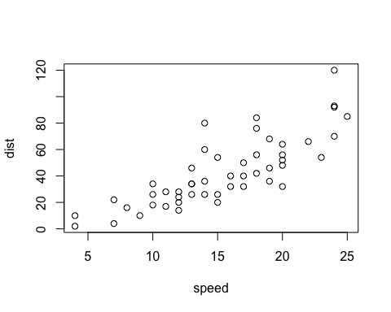
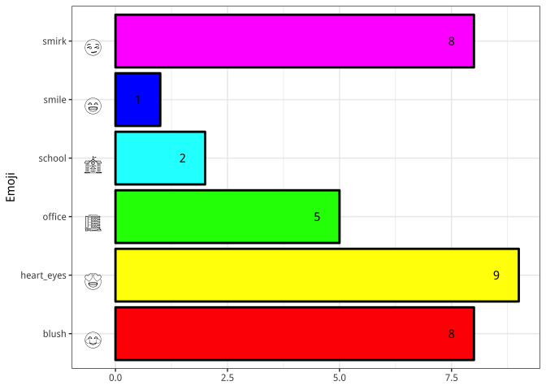
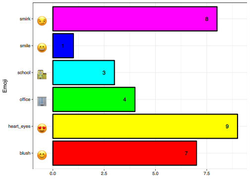
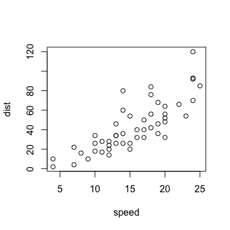

### Basic Markdown

The following contents are adapted from 

- [Introduction to Markdown by RStudio](https://rmarkdown.rstudio.com/authoring_basics.html)
- [James Steiger's Blog](http://www.statpower.net/Content/310/R%20Stuff/SampleMarkdown.html)
- [Archer's blog](http://csrgxtu.github.io/2015/03/20/Writing-Mathematic-Fomulars-in-Markdown/)


Before we proceed to learn the Markdown and R Markdown languages. Let us install the [editR](https://github.com/swarm-lab/editR) package first. editR is a R Markdown editor with instant previewing capacity such that you do not have to repeatedly `knit` it to see the outcome. 

In your R console, type
```
if (!require("devtools")) install.packages("devtools")
devtools::install_github("trestletech/shinyAce")
devtools::install_github("swarm-lab/editR")
```

After the package is properly installed, run the following code in your R console. 
```
library(editR)
editR()
```

An interactive prompt will come up and you can use it to open .Rmd files in the same way you would use Microsoft Office to open .docx files. Enjoy the instant previewing. 


#### Headers

```
# Header 1
## Header 2
### Header 3
#### Header 4
##### Header 5
##### Header 6
```

```
# Header 1
## Header 2
### Header 3
#### Header 4
##### Header 5
##### Header 6
```

<br>

#### Texts in Markdown

**Intervening Spaces**

```
White spaces between texts do nothing in R Markdown.        Eight whitespaces (or four Tabs)
and a newline have no effect. 
```

White spaces between texts do nothing in R Markdown.        Eight whitespaces (or four Tabs)
and a newline have no effect. 


**Two or More Trailing Spaces**

```
However, adding two or more trailing spaces by the end of the line  (two spaces are here!)
would break the line.
```

However, adding two or more trailing spaces by the end of the line  
would break the line. 


**Intervening Newlines**

```
If there is a newline in between,

it will create a new paragraph. 
```

If there is a newline in between,

it will create a new paragraph. 


#### Code & Quotes {#codequote}


**Inline Code**

Inline code such as `x = x+1` can be created by wrapping code with a backstick sign ` ` `, e.g. `` `x = x+1` ``.  

Characters within inline code lose their meaings and are dispalyed verbatim (i.e., not run or evaluated). 

**Code Blocks**

To create a **code block** (aka **code in display mode**), as shown below, surround multiple lines of code with three backstick signs ` ``` ` at the preceding and succeding lines. 

```
x = 1
y = x + 1
answer = y * 2
```

Characters within code blocks also lose their meanings and are displayed verbatim (see an exception at [Executable R Code](#rcode)). We have been using code blocks all along in the previous sections to contrast snippets of raw code with their effects. 


**Block Quotes**

Block quotes follow the same three rules regarding (a) intervening spaces, (b) two trailing spaces, and (c) intervening newlines. The quote below is credited to Sarah Ban Breathnach, a New York Times best-selling author. 

```
> The world needs dreamers and the world needs        doers. 
But above all the world needs dreamers who do. 
```

> The world needs dreamers and the world needs        doers. 
But above all the world needs dreamers who do. 

```
> The world needs dreamers and the world needs doers.  (two spaces are here!)
But above all the world needs dreamers who do. 
```

> The world needs dreamers and the world needs doers.  
But above all the world needs dreamers who do. 

```
> The world needs dreamers and the world needs doers.

> But above all the world needs dreamers who do. 
```

> The world needs dreamers and the world needs doers.

> But above all the world needs dreamers who do. 

Wait a second, an intervening newline breaks the quote bar. Fix it by adding a `>` in between the two bars to join them together. 

```
> The world needs dreamers and the world needs doers.
>
> But above all the world needs dreamers who do. 
```

> The world needs dreamers and the world needs doers.
>
> But above all the world needs dreamers who do. 


#### Emphasis

The table below contrast code and its effect. 

|Code|Effect|Note|
|:---|:---:|---|
|`_italic_`|_italic_| recommened |
|`*italic*`|*italic*| `*` and `_` are identical |
|`__bold__`|__bold__|
|`**bold**`|**bold**| recommened |
|`___italic-and-bold___`|___italic-and-bold___|
|`***italic-and-bold***`|***italic-and-bold***|
|`**_italic-and-bold_**`|**_italic-and-bold_**| recommended |
|`~~strikethrough~~`|~~strikethrough~~|
|`X~i~`|X~i~| subscript |
|`X^2^`|X^2^| superscript |
|`X~i~^2^`|X~i~^2^| subscript followed by superscript |
|`X^2^~i~`|X^2^~i~| superscript followed by subscript |


**Horizontal Rule**

Three or more asterisks or dashes create a _horizontal rule_, aka **page break**. 

```
***
```

***

or 

```
---
```

---

#### Links

**Links to Websites**

Links can be either naked or in the form of `[mandatory text](http://somesite.com "optional hover message")`. Operative links must start with `http` or `https`.

```
www.baidu.com

https://www.baidu.com/

[](https://www.baidu.com/)    # no mandatory text, no links whatsoever

[Baidu Search Engine - malfunctioning](www.baidu.com "This link would not work")

[Baidu Search Engine - functioning](https://www.baidu.com/ "This link would work")

```

www.baidu.com

https://www.baidu.com/

[](https://www.baidu.com/)

[Baidu Search Engine - malfunctioning](www.baidu.com "This link would not work")

[Baidu Search Engine - functioning](https://www.baidu.com/ "This link would work")


**Links to Images**

Images on the web or local disks can be loaded in the simple form of `` or in the full form of

`{optional figure-control arguments}`


```
{width=400px}

{width=400px}

{width=400px}
```

{width=400px}

{width=400px}

{width=400px}

**Reference-style Links**

```
Hover to see [where this link directs you][id].

[id]: http://www.baidu.com "This is Baidu.com"

This graph represents a well-known rule in statistics:
![caption not displayed due to absence of line break][id2]

[id2]: ../../quantbook/images/intro_rule.png "This is the 68-95-99.7 Rule"
```

Hover to see [where this link directs you][id].

[id]: http://www.baidu.com "This is Baidu.com"

This graph represents a well-known rule in statistics:
![caption not displayed due to absence of line break][id2]

[id2]: ../../quantbook/images/intro_rule.png "This is the 68-95-99.7 Rule"


#### Unordered Lists

- Start an unordered list with any one of `-`, `+`, or `*`. They are **completely identical**. 
- To create nested sub-lists, indent with **four spaces** (or hitting the `tab` key twice to create the equivalent of four spaces). 
- Unordered lists only work for **two or three levels**, depending on your output format, i.e., html, pdf, or docx. 

To emphasize again, using any one of `-`, `+`, or `*` would give completely identical result. 

```
- item1
- item2
    - item2.1
    - item2.2
        - item2.2.1
        - item2.2.2
            - item2.2.2.1
            - item2.2.2.2
```

- item1
- item2
    - item2.1
    - item2.2
        - item2.2.1
        - item2.2.2
            - item2.2.2.1
            - item2.2.2.2


#### Ordered Lists

| type | works | fails |
|---|---|---|
| arabic numerals | `1.` or `(1)` | `1` or `(1).` |
| English alphabet | `a.` or `(a)` | `a` or `(a).` |
| roman numerals | `i.` or `(i)` | `i` or `(i).` |

To note, you can of course mix ordered lists with unordered lists. 

```
2. Item 1
9. Item 2
8. Item 3
    (3) Item 3.1
    (1) Item 3.2
7. Item 4
(4) Item 5
(1) Item 6
(1) Item 7
    2. Item 7.1
    1. Item 7.2
```

2. Item 1
9. Item 2
8. Item 3
    (3) Item 3.1
    (1) Item 3.2
7. Item 4
(4) Item 5
(1) Item 6
(1) Item 7
    2. Item 7.1
    1. Item 7.2

The same rules apply to **English alphabet** and **Roman numerals**.

```
b. Item 1
d. Item 2  
c. Item 3  
    (c) Item 3.1
    (a) Item 3.2
z. Item 4
(c) Item 5
(a) Item 6  
(a) Item 7
    b. Item 7.1
    b. Item 7.2
```

b. Item 1
d. Item 2  
c. Item 3  
    (c) Item 3.1
    (a) Item 3.2
z. Item 4
(c) Item 5
(a) Item 6  
(a) Item 7
    b. Item 7.1
    b. Item 7.2


```
ii. Item 1
iv. Item 2  
viii. Item 3  
    (iii) Item 3.1
    (i) Item 3.2
vii. Item 4  
(iv) Item 5 
(i) Item 6
(i) Item 7
    ii. Item 7.1
    i. Item 7.2
```

ii. Item 1
iv. Item 2  
viii. Item 3  
    (iii) Item 3.1
    (i) Item 3.2
vii. Item 4  
(iv) Item 5 
(i) Item 6
(i) Item 7
    ii. Item 7.1
    i. Item 7.2


#### Tables

```
|order|name|producing area|price|
|---|:---|---:|:---:|
|1|banana|hainan|2￥/kg|
|2|apple|baishui|4￥/kg|
|3|mango|zhangzhou|8￥/kg|
|4|watermelon|jinhua|1￥/kg|
```

|order|name|producing area|price|
|---|:---|---:|:---:|
|1|banana|hainan|2￥/kg|
|2|apple|baishui|4￥/kg|
|3|mango|zhangzhou|8￥/kg|
|4|watermelon|jinhua|1￥/kg|

Without table headers, we can use empty image tags, e.g. ``, to control column widths. 

```
| | | | |
|---|---|---|---|
|||||
|1|banana|hainan|2￥/kg|
|2|apple|baishui|4￥/kg|
|3|mango|zhangzhou|8￥/kg|
|4|watermelon|jinhua|1￥/kg|

```

| | | | |
|---|---|---|---|
|||||
|1|banana|hainan|2￥/kg|
|2|apple|baishui|4￥/kg|
|3|mango|zhangzhou|8￥/kg|
|4|watermelon|jinhua|1￥/kg|  

<br><br>
`TODO`: How to control column width with table headers?

|order|name|producing area|price|
|---|---|---|---|
|||||
|1|banana|hainan|2￥/kg|
|2|apple|baishui|4￥/kg|
|3|mango|zhangzhou|8￥/kg|
|4|watermelon|jinhua|1￥/kg|  

`TODO`: try using CSS code to format table width

.foo table {
  styles...
}

<div class="foo">

Header | header
------ | -----
Bar | bar

</div>


References

- [Set table column width](https://stackoverflow.com/questions/36121672/set-table-column-width-via-markdown)
- [Control cell width in pandoc Markdown table](https://stackoverflow.com/questions/27219629/how-to-control-cell-width-in-pandoc-markdown-table)
- [Create HTML tables with knitr::kable and kableExtra](https://haozhu233.github.io/kableExtra/awesome_table_in_html.html) or [this link with identical contents](https://cran.r-project.org/web/packages/kableExtra/vignettes/awesome_table_in_html.html)

### R Markdown

#### Executable R Code {#rcode}

- In Markdown, one backstick sign ` ` ` starts inline code and three ` ``` ` start code blocks. 

- Similarly, in R Markdown, one ` ` ` introduces executable inline R code and three ` ``` ` for R code blocks. 

**Inline Code vs. Code Block**

Let us **display** 1+1. Using inline Markdown code `` `1+1` `` gives `1+1` and Markdown code block gives

```
1+1

```

Let us **compute** 1+1. Using inline R code `` `r 1+1` `` gives 2 and R code block gives


```r
1+1
```

```
## [1] 2
```

To be more precise in language, we will refer to an executable R code block as a **code chunk** to distinguish it from a non-executable Markdown **code block**.


**Inline R Code**

Placing an `r` **immediately** after a backstick sign ` ` ` starts inline R code, e.g. `` `r some_r_code` ``, that will always be evaluated, showing only result but not code. 

For example, given the popular **iris** dataset, we want to show the number of rows in it. You can type `nrow(iris)` into the R console, see the result, and then manually report the result as follows. 

```
The iris dataset has 150 rows. 
```

The iris dataset has 150 rows. 

This is OK. But using incline code is much easier. 

```
The iris dataset has `r nrow(diamonds)` rows.

```

The iris dataset has 150 rows. 


`NOTE`: Even within Markdown code blocks, inline R code will still be executed, an exception to the "no-execution-within-blocks-rule" discussed previously at [Code & Quotes](#codequote). In here, we will have to give it some special treatment to include inline R code in code blocks. 

**R Code Chunks**

Placing an `{r}` **immediately** after three backstick signs ` ``` ` with another set of three closing backstick signs ` ``` ` creates an R code block, e.g. `` ```{r} lines of code``` ``. By default, the code block will be evaluated, showing the code and the result. 


```r
summary(cars)
```

```
##      speed           dist       
##  Min.   : 4.0   Min.   :  2.00  
##  1st Qu.:12.0   1st Qu.: 26.00  
##  Median :15.0   Median : 36.00  
##  Mean   :15.4   Mean   : 42.98  
##  3rd Qu.:19.0   3rd Qu.: 56.00  
##  Max.   :25.0   Max.   :120.00
```


```r
plot(cars)
```

<!-- -->

You can control whether to evaluate the code (and hence show the result) or to show the code by changing the `eval` and `echo` arguments. 

| ID | show code | show result | argument | note |
|---|---|---|---|
|A|Yes|Yes| `{r eval=TRUE, echo=TRUE}` | the default|
|B|Yes|No| `{r eval=FALSE, echo=TRUE}` |
|C|No|Yes| `{r eval=TRUE, echo=FALSE}` |
|D|No|No| `{r eval=FALSE, echo=FALSE}` |

A

```r
summary(cars)
```

```
##      speed           dist       
##  Min.   : 4.0   Min.   :  2.00  
##  1st Qu.:12.0   1st Qu.: 26.00  
##  Median :15.0   Median : 36.00  
##  Mean   :15.4   Mean   : 42.98  
##  3rd Qu.:19.0   3rd Qu.: 56.00  
##  Max.   :25.0   Max.   :120.00
```

B

```r
summary(cars)
```

C

```
##      speed           dist       
##  Min.   : 4.0   Min.   :  2.00  
##  1st Qu.:12.0   1st Qu.: 26.00  
##  Median :15.0   Median : 36.00  
##  Mean   :15.4   Mean   : 42.98  
##  3rd Qu.:19.0   3rd Qu.: 56.00  
##  Max.   :25.0   Max.   :120.00
```

D


Other important chunk arguments include:

* `include = FALSE` runs and evaluates the code, but does NOT show the code or results in the final document
* `message = FALSE` or `warning = FALSE` prevents messages or warnings from appearing in the finished file
* `results = "hide"` or `fig.show = "hide"` hides printed output or plots
* `error = TRUE` allows file to render even if the code returns an error


Some keyboard shortcuts regarding R code chunks are listed below. 

| Keyboard Shortcut | Action | Same As |
|---|---|---|
| Cmd/Ctrl + Alt + I | insert a code chunk | type ` ``` ` around `{r}`
| Cmd/Ctrl + Enter | run selected code within a code chunk | run selected R code
| Cmd/Ctrl + Shift + Enter | run the entire code chunk | press the run button
| Cmd/Ctrl + Shift + K | knit the entire R Markdown document | click "Knit"


#### Advanced Formatting


**Add Backstick Sign**

Backstick signs are used to start inline code and code blocks/chunks. They are difficulty to deal with. 

* wrap ` ` ` with ` ` ` + one whitespace to represent ` ` `
* wrap ` ``` ` with ` ` ` + one whitespace to represent ` ``` `

For more complex expressions, we will need to create some convenient functions to represent them.  


```r
# A
inline_mdcode <- function(x = "") paste0("`` `", x, "` ``")
# B
inline_mdcode_inblock <- function(x = "") paste0("`", x, "`")
# C
inline_rcode <- function(x = "") paste0("`` `r ", x, "` ``")
# D
inline_rcode_inblock <- function(x = "") paste0("`r ", x, "`")
# E
inline_header <- function(x = "") paste0("`{r ", x, "}`")
# F
inline_rchunk <- function(x = "") paste0("`` ```{r} ", x, "``` ``")
```

* A: inline_mdcode("TODO")

`` `TODO` ``

* B: inline_mdcode_inblock("TODO")

```
`TODO`

```

* C: inline_rcode("1+2")

`` `r 1+2` ``

* D: inline_rcode_inblock("1+2")

```
`r 1+2`

```

* E: inline_header("fig.width=5, collapse=TRUE")

`{r fig.width=5, collapse=TRUE}`

* F: inline_rchunk("string")

`` ```{r} x=1; y=x+1``` ``


**Format Markdown Text**

Markdown offers a variety of basic text formatting constructs, e.g. **bold**, _italics_, and ~~strikethrough~~. Oftentimes, however, we will simply need more advanced formatting. In the following, we will use inline code `TODO` as a running example. 

* HTML Code

The simplest way is to use HTML code to enrich Markdown text formatting. 

```
<span style="color:red; background:yellow"> `TODO` </span>
```

<span style="color:red; background:yellow"> `TODO` </span>

We can write an R function and use inline R code to simplify the typing (see an example below). 


```r
highlight = function(x="", upper=TRUE) {
  ### HTML code to format Markdown inline code
  if (upper) {x = toupper(x)}
  style = 'color:red; background:yellow; background-size: 20%'
  sprintf("<span style='%s'>`%s`</span>", style, x)
}
```

* CSS Code

Alternatively, we can use CSS code to enrich Markdown text formatting.


```css
.custom-inline {
  color: red;
  background: yellow;
}
```


<style type="text/css">
.custom-inline {
  color: red;
  background: yellow;
}
</style>

And write an R function to simply the typing (see an example below). 


```r
highlight_css <- function(x="", upper=TRUE) {
  ### HTML code to format Markdown inline code
  if (upper) {x = toupper(x)}
  sprintf("<span class='custom-inline'>%s</span>", x)
}
```

* R Library

The `kableExtra::text_spec()` function can be invoked within inline R code for text formatting.  


```r
library(kableExtra)
```


|Code|Effect|Note|
|---|---|---|
| `` `TODO` `` | `TODO` | raw Markdown code |
| `` `r highlight("todo")` `` | <span style='color:red; background:yellow; background-size: 20%'>`TODO`</span> | HTML code |
| `` `r highlight_css("todo")` `` | <span class='custom-inline'>TODO</span> | CSS code |
| `` `r text_spec("TODO", color="red", background="yellow")` `` | <span style="     color: red;border-radius: 4px; padding-right: 4px; padding-left: 4px; background-color: yellow;" >TODO</span> | `kableExtra::text_spec()` |

References

- [format text using HTML code](https://stackoverflow.com/questions/35465557/how-to-apply-color-in-markdown)
- [format text using CSS code and R library](https://stackoverflow.com/questions/50727217/rmarkdown-change-inline-code-color)
- [CSS font families & styles](https://www.w3.org/Style/Examples/007/fonts.en.html)
- [CSS tutorial and resource](https://www.quackit.com/css/)


**Show/Hide Button**

* HTML Code

```
<button class="btn btn-primary" data-toggle="collapse" data-target="#id1">Show Answer</button>  
<div id="id1" class="collapse"><br>

The solution is simple. Try this out

$$x = x + 1$$

</div><br>

```

<button class="btn btn-primary" data-toggle="collapse" data-target="#id1">Show Answer</button>  
<div id="id1" class="collapse"><br>

The solution is simple. Try this out

$$x = x + 1$$

</div><br>


```r
toggle_button = function(id="id", txt="Show Answer") {
  sprintf("<button class='btn btn-primary' data-toggle='collapse' data-target='#%s'>%s</button>\n
  <div id='%s' class='collapse'><br>", id, txt, id)
}
```


Now let's use the R function to create a new button in the following format. 

```
`r toggle_button('id2')`

# write regular Markdown & R Markdown code here!

</div><br>

```


<button class='btn btn-primary' data-toggle='collapse' data-target='#id2'>Show Answer</button>

  <div id='id2' class='collapse'><br>

In summary,

|Code|Effect|
|---|---|
|`code`|code|
|`**code**`|**code**|
|`_code_`|_code_|

</div><br>

References

- [Collapsing contents in R Markdown](https://stackoverflow.com/questions/42630248/collapsing-hiding-figures-in-r-markdown)
- [Full control over R script chunks](https://stackoverflow.com/questions/37755037/how-to-add-code-folding-to-output-chunks-in-rmarkdown-html-documents)


**Include Emojis**

* The `emo` Library


```r
# devtools::install_github("hadley/emo")
library(emo)
```


||||||
|---|---|---|---|---|
||||||
|😊|:blush:||😭|:sob:|
|😎|:sunglasses:||😱|:scream:|
|❗|:exclamation:||❓|:question:|
|👍|:+1:||👎|:-1:|

<br><br>

* The `emojifont` Library


```r
library(emojifont)
library(ggplot2)

emoji_name = c("smile","school","office","blush","smirk","heart_eyes")
dat = as.data.frame(emoji_name)
dat$emoji = emojifont::emoji(dat$emoji_name)
dat$freq = sort(sample(1:10, nrow(dat), TRUE))

p = ggplot(dat, aes(emoji_name, freq, fill=emoji_name)) +
  geom_bar(stat="identity", color = "black", size = 1) +
  geom_text(aes(label=freq), nudge_y=-0.5) +
  scale_fill_manual(values = rainbow(nrow(dat)),
                    breaks = 1:nrow(dat),
                    labels = as.character(dat$emoji)) +
  geom_text(aes(y=-0.5, label=emoji), size=6, family="EmojiOne") +
  guides(fill = guide_legend(reverse = TRUE)) +
  labs(x = "Emoji", y = NULL) +
  coord_flip() +
  theme_bw()

p
```

<!-- -->


```r
library(gridSVG)
p
ps = grid.export("../images/emoji.svg", addClass=T)
```


```r
library(convertGraph)
path = "phantomjs"
convertGraph("../images/emoji.svg", "../images/emoji.png", path=path)
```

Now, let's load the .png file. 




References

- [Plot emojis in R](https://stackoverflow.com/questions/47730589/plot-emojis-emoticons-in-r-with-ggplot)


#### More on Chunk Settings

Chunk output can be customized with optional arguments supplied to chunk header. For a full list of such options, please refer to [this link](http://yihui.name/knitr/options/).

Chunk options can be set either locally in a check header (as discussed above and below) or globally as follows using the `knitr::opts_chunk$set()` function. 


```r
knitr::opts_chunk$set(
  commet = "#>",
  collapse = TRUE
)
```

**Collapse Output**

By default, `collapse=FALSE` pushes results instantly to display outputs separately. 


```r
1+1
```

```
## [1] 2
```

```r
2+2
```

```
## [1] 4
```

The `collapse=TRUE` option will collapse outputs if possible. 


```r
1+1
## [1] 2
2+2
## [1] 4
```

An alternative is to use `results="hold"`, which would hold pushing results and display them by the end of one chunk. 


```r
1+1
2+2
```

```
## [1] 2
## [1] 4
```


**Comment Output**

Use the `comment` argument within `{r}` to set the text preceding console output, where the default is `comment="##"`. 


```r
head(cars)
```

```
##   speed dist
## 1     4    2
## 2     4   10
## 3     7    4
## 4     7   22
## 5     8   16
## 6     9   10
```

For example, we can remove `##` by setting `{r comment=""}`. 


```r
head(cars)
```

```
  speed dist
1     4    2
2     4   10
3     7    4
4     7   22
5     8   16
6     9   10
```

**Control Figures**

Use `fig.width` and `fig.height` arguments to control figure size. The following figure is rendered with `{r fig.width=4, fig.height=4}`.


```r
plot(cars)
```


You can also postpone display of figures by setting `fig.show="hold"` such that knitr will hold and display figures by the end of the chunk. 

For example, using `{r fig.show="hold", fig.width=4, fig.height=4, results="hold"}`, we will get


```r
plot(cars)
3+3
2+1
```

```
## [1] 6
## [1] 3
```

<!-- -->

Otherwise, using `{r fig.width=4, fig.height=4, results="hold"}`, we will get


```r
plot(cars)
```

<!-- -->

```r
3+3
2+1
```

```
## [1] 6
## [1] 3
```


**Name Chunks**

A chunk can be given an optional name, e.g. `{r chunkname}`, which offers three advantages. 


* **easier to navigate** to specific chunks: The code navigator in the bottom-left of the script editor makes it easier to navigate among chunks. 
* **easier to invoke figures** later: Chunk labels are used to generate filenames for graphs stored on disk, so naming chunks makes it easier to reuse plots.
* **easier to set up cached chunks**: Avoid re-performing expensive computations on every run. More on this below. 


**Cache Results**

Sometimes, a certain chunk will take too long to compute. As a result, we would like to store the output so that it saves us time next time we run the same chunk.

The solution is `cache = TRUE`. When set, this will save a chunk's output to specially named files on disk. On subsequent runs, knitr will check to see **if the code has changed**, and if it hasn’t, it will directly reuse the cached results.

To illustrate the point, Let's create two chunks such that `chunk2` depends on `chunk1`. 

The caching sytem is **code-dependent**, not content-dependent. In our case, output from `chunk2` will NOT change as long as the _code_ in it is not changing, regardless any changes in code made in `chunk1`.  

To establish content dependency, we need to mannually set the `dependson` argument, i.e. setting `dependson="chunk1"` in `chunk2`. 

Since caching is only code-dependent, if the data source `diamonds` changes, results from `chunk1` still would NOT change: data is changing, but the _code_ remains the same. We have to use the `cache.extra` option to track the data source such that changes in the dataset would affect subsequent changes in chunk output. 


```r
# header1: {r chunk1}
# header2: {r chunk1, cache.extra = file.info("diamonds")}
n = 100
xdat = ggplot2::diamonds[1:n,]
```


```r
# header3: {r chunk2, cache=TRUE}
# header4: {r chunk2, cache=TRUE, dependson="chunk1"}
dim(xdat[xdat$carat<0.5,])
```

```
## [1] 90 10
```

- With `header1` in `chunk1`, changes in data source do not affect output from `chunk1`.
- With `header2` in `chunk1`, changes in data source will affect subsequent output from `chunk1`.
- With `header3` in `chunk2`, changing `n = 100` to `n = 10000` in `chunk1` will not affect output from `chunk2`, since caching is code-dependent. 
- With `header4` in `chunk2`, changing `n = 100` to `n = 10000` in `chunk1` will affect output from `chunk2`, since content-dependency is now established.

As your caching strategies get progressively more complicated, it’s a good idea to regularly clear out all your caches with `knitr::clean_cache()` or simply deleting the caching foler on disk. 

Please refer to [this StackOverflow link](https://stackoverflow.com/questions/10628665/how-to-set-cache-false-for-a-knitr-markdown-document-and-override-code-chunk-set/10629121#10629121) for more tips on caching.


**Create Markdown Code Programmatically** 

By setting the chunk with `{r results="asis", echo=FALSE}`, we can output R results directly as Markdown code. 

```
y = sample(10)
cat("Here are some bullet points\n\n")
cat(paste("* The value of y[", 1:3, "] is ", y[1:3], sep="", collapse="\n"))

```

Here are some bullet points

* The value of y[1] is 7
* The value of y[2] is 8
* The value of y[3] is 5

To note, setting `echo=FALSE` is extremely important here, as R Markdown will automatically display multiple outputs separately (e.g. results from the two `cat()` functions). Without setting `echo=FALSE`, the following code would NOT be rendered properly. 

`NOTE`: The argument `collapse=TRUE` won't work here!

```
cat("x | y", "--- | ---", sep="\n")
cat(apply(cars[1:5,], 1, function(X) paste(X, collapse=" | ")), sep = "\n")

```

speed | dist
--- | ---
4 | 2
4 | 10
7 | 4
7 | 22
8 | 16

A complete treatment on R Markdown chunk options and package options can be found in [Yihui's Blog](http://yihui.name/knitr/options/); Yihui is the author of the rmarkdown package. 


### Mathematical Symbols in Latex

There are two ways to introduce mathematical equations formatted by **Latex**.

- using `$` for introducing inline equations, e.g. `$x+1$` gives $x+1$
- using `$$` for presenting stand-alone equations in display mode, e.g. `$$x+1$$` gives $$x+1$$

#### Texts

Surrounded within `$` or `$$` sign, whitespaces lose their meaning. Must use `~` or `\,` to denote a whitespace. For the sake of clarity, use `~` whenever applicable. Note, `~` gives slightly bigger space than `\,`, but who cares.

```
$$ab, a b, a    b, a~b, a\,b, a~~b, a\,\,b, a~~~b, a\,\,\,b$$
```

$$ab, a b, a    b, a~b, a\,b, a~~b, a\,\,b, a~~~b, a\,\,\,b$$

By default, texts within `$` are italized. You will have to use special Latex commands to ask for regular non-italized fonts. 

```
$$ abc, \text{abc}, \boldsymbol{abc}, \mathbf{abc}, \exp(x), \sin, \cos, \lim $$
```

$$ abc, \text{abc}, \boldsymbol{abc}, \mathbf{abc}, \exp(x), \sin, \cos, \lim $$


|Code|Effect|Note|
|---|---|---|
|`$abc$`|$abc$| text is italicized by default |
|`$\text{abc}$`|$\text{abc}$| non-italicized font | 
|`$\boldsymbol{abc}$`|$\boldsymbol{abc}$| bold and italicized |
|`$\mathbf{abc}$`|$\mathbf{abc}$| bold and non-italicized font|
|`$\exp(x)$`|$\exp(x)$| exponentiate |
|`$\sin$`|$\sin$| sine |
|`$\cos$`|$\cos$| cosine |
|`$\lim$`|$\lim$|

#### Greek Letters

|Code|Effect|Note|
|---|---|---|
|`$\alpha$`|$\alpha$|
|`$A$`|$A$|
|`$\beta$`|$\beta$|
|`$\gamma$`|$\gamma$|
|`$\Gamma$`|$\Gamma$|
|`$\delta$`|$\delta$|
|`$\Delta$`|$\Delta$|
|`$\pi$`|$\pi$|
|`$\Pi$`|$\Pi$|
|`$\phi$`|$\phi$|
|`$\Phi$`|$\Phi$|
|`$\varphi$`|$\varphi$|
|`$\theta$`|$\theta$|

#### Algebraic Representation

```
$$ x_i, x_{ij}, x_{i+1}, x^2, x^{2/3}, x_i^2, x^2_i, \sqrt{x}, \sqrt[^n]{x}, \frac{2}{3}, \binom{n}{k} $$
```

$$ x_i, x_{ij}, x_{i+1}, x^2, x^{2/3}, x_i^2, x^2_i, \sqrt{x}, \sqrt[^n]{x}, \frac{2}{3}, \binom{n}{k} $$


|Code|Effect|Note|
|:---|:---|:---|
|`$x_i$`|$x_i$| subscript |
|`$x_{ij}$`|$x_{ij}$| must use `{}` with more than one character |
|`$x_{i+1}$`|$x_{i+1}$| another example |
|`$x^2$`|$x^2$| superscript |
|`$x^{2/3}$`|$x^{2/3}$| another example |
|`$x_i^2$`|$x_i^2$| subscript and superscript |
|`$x^2_i$`|$x^2_i$| superscript and subscript (identical; order does not matter) |
|`$\sqrt{x}$`|$\sqrt{x}$| square root |
|`$\sqrt[^n]{x}$`|$\sqrt[^n]{x}$|
|`$\frac{2}{3}$`|$\frac{2}{3}$| fraction |
|`$\binom{n}{k}$`|$\binom{n}{k}$| binomial coeffcient |


#### Algebraic Operations

```
$$ \times, \div, \pm, \mp, \ne, \le, \ge, \ll, \gg, \approx, \sim, \equiv, \cong, \propto, \infty $$
```

$$ \times, \div, \pm, \mp, \ne, \le, \ge, \ll, \gg, \approx, \sim, \equiv, \cong, \propto, \infty $$


|Code|Effect|Note|
|:---|:---|---|
|`$\times$`|$\times$| multiplication sign |
|`$\div$`|$\div$| division sign |
|`$\pm$`|$\pm$| plus and minus |
|`$\mp$`|$\mp$| minus and plus |
|`$\ne$`|$\ne$| not equal |
|`$\le$`|$\le$| less than or equal to |
|`$\ge$`|$\ge$| greater than or equal to |
|`$\ll$`|$\ll$| much less than |
|`$\gg$`|$\gg$| much greater than |
|`$\approx$`|$\approx$| approximate to |
|`$\sim$`|$\sim$| similar to |
|`$\equiv$`|$\equiv$| equivalent to |
|`$\cong$`|$\cong$| 
|`$\propto$`|$\propto$| proportion to |
|`$\infty$`|$\infty$| infinity |

#### Set Operations

```
$$ \forall, \exists, \nexists, \cup, \cap, \in, \ni, \emptyset $$
```

$$ \forall, \exists, \nexists, \cup, \cap, \in, \ni, \emptyset $$

|Code|Effect|Note|
|---|---|---|
|`$\forall$`|$\forall$|
|`$\exists$`|$\exists$|
|`$\nexists$`|$\nexists$|
|`$\cup$`|$\cup$|
|`$\cap$`|$\cap$|
|`$\in$`|$\in$|
|`$\ni$`|$\ni$|
|`$\emptyset $`|$\emptyset$|


#### Calculus Symbols

$$ \sum, \prod, \partial{x}, \int,    $$

|Code|Effect|Note|
|---|---|---|
|`$\sum$`|$\sum$|
|`$\prod$`|$\prod$|
|`$\coprod$`|$\coprod$|
|`$\partial{x}$`|$\partial{x}$|
|`$\int$`|$\int$|
|`$\int x \,\mathrm{d}x$`|$\int x \,\mathrm{d}x$|
|`$\oint$`|$\oint$|
|`$\iint$`|$\iint$|
|`$\idotsint$`|$\idotsint$|
|`$\int_a^b$`|$\int_a^b$|
|`$\int\limits_a^b$`|$\int\limits_a^b$|


#### Statistics & Linear Algebra Symbols

```
$$ \overset{iid}{\sim}, \underset{(1)}{=}, \underset{\text{below}}{\overset{\text{above}}{=}} $$
```

$$ \overset{iid}{\sim}, \underset{(1)}{=}, \underset{\text{below}}{\overset{\text{above}}{=}} $$

```
$$  \therefore, \cdot, \cdots, \dots, \ldots, \vdots, \ddots, \bullet, \dot A, \dot \forall $$
```

$$  \therefore, \cdot, \cdots, \dots, \ldots, \vdots, \ddots, \bullet, \dot A, \dot \forall $$


|Code|Effect|Note|
|---|---|---|
|`$\hat{a}$`|$\hat{a}$|
|`$\bar{a}$`|$\bar{a}$|
|`$\vec{a}$`|$\vec{a}$|
|`$\overset{iid}{\sim}$`|$\overset{iid}{\sim}$|
|`$\underset{(1)}{=}$`|$\underset{(1)}{=}$|
|`$\underset{b}{\overset{a}{=}}$`|$\underset{b}{\overset{a}{=}}$|
|`$\cdot$`|$\cdot$|
|`$\cdots$`|$\cdots$|
|`$\dots$`|$\dots$|
|`$\ldots$`|$\ldots$|
|`$\vdots$`|$\vdots$|
|`$\ddots$`|$\ddots$|
|`$\bullet$`|$\bullet$|
|`$\dot A$`|$\dot A$|
|`$\dot\forall$`|$\dot\forall$|
|`$\therefore$`|$\therefore$|
|`$\overrightarrow{AB}$`|$\overrightarrow{AB}$|
|`$\overline{aaa}$`|$\overline{aaa}$|
|`$\bigoplus$`|$\bigoplus$|
|`$\bigotimes$`|$\bigotimes$|
|`$\bigodot$`|$\bigodot$|
|`$\bigotimes$`|$\bigotimes$|
|`$\biguplus$`|$\biguplus$|
|`$\bigsqcup$`|$\bigsqcup$|
|`$\bigvee$`|$\bigvee$|
|`$\bigwedge$`|$\bigwedge$|


#### Other Mathematical Symbols

|Code|Effect|Note|
|---|---|---|
|`$\nabla$`|$\nabla$|
|`$\grave{a}$`|$\grave{a}$|
|`$\acute{a}$`|$\acute{a}$|
|`$\dot{a}$`|$\dot{a}$|
|`$\ddot{a}$`|$\ddot{a}$|
|`$\ddot{a}$`|$\ddot{a}$|
|`$\mathring{a}$`|$\mathring{a}$|
|`$\check{a}$`|$\check{a}$|
|`$\underline{aaa}$`|$\underline{aaa}$|
|`$\to$`|$\to$|
|`$\rightarrow$`|$\rightarrow$|
|`$\gets$`|$\gets$|
|`$\leftarrow$`|$\leftarrow$|
|`$\uparrow$`|$\uparrow$|
|`$\downarrow$`|$\downarrow$|
|`$\leftrightarrow$`|$\leftrightarrow$|
|`$(a)$`|$(a)$|
|`$[a]$`|$[a]$|
|`$\langle f \rangle$`|$\langle f \rangle$|
|`$\lfloor f \rfloor$`|$\lfloor f \rfloor$|
|`$\lceil f \rceil$`|$\lceil f \rceil$|
|`$\ulcorner f \urcorner$`|$\ulcorner f \urcorner$|

#### Matrices

- a matrix begins with `\begin{array}` and ends with `\end{array}`
- we use the code `{rrr}` to indicate that each column is right justified
- cells are separated by the `&` symbol
- each line (except the last) is terminated by `\\`

```
$$
\begin{array}
{rrr}
1 & 2 & 3 \\
4 & 5 & 6 \\
7 & 8 & 9
\end{array}
$$
```

$$
\begin{array}
{rrr}
1 & 2 & 3 \\
4 & 5 & 6 \\
7 & 8 & 9
\end{array}
$$

In math textbooks, matrices are often surrounded by brackets, and are assigned to a boldface letter.  Here is an example

```
$$
\mathbf{X} = \left[\begin{array}
{rrr}
1 & 2 & 3 \\
4 & 5 & 6 \\
7 & 8 & 9
\end{array}\right]
$$
```

$$
\mathbf{X} = \left[\begin{array}
{rrr}
1 & 2 & 3 \\
4 & 5 & 6 \\
7 & 8 & 9
\end{array}\right]
$$


#### Practice

Try to reproduce the code for the following formulas. 

```
$$\sum_{i=1}^{n}\left( \frac{X_i}{Y_i} \right)$$
```
$$\sum_{i=1}^{n}\left( \frac{X_i}{Y_i} \right)$$

Hint: In LaTeX, you can create parentheses, brackets, and braces which size themselves automatically to contain large expressions. You do this using the `\left` and `\right` operators.  Here is an example


```
$$ \sum_{i=1}^{n} (X_i - \bar{X})(Y_i - \bar{Y}) $$
```
$$ \sum_{i=1}^{n} (X_i - \bar{X})(Y_i - \bar{Y}) $$

```
$$\int_0^{2\pi} \sin x~dx$$
```
$$\int_0^{2\pi} \sin x~dx$$


