--- 
title: "Quantitative Research Methods for Education"
author: "Wenliang He"
date: "`r paste('Updated on', as.character(Sys.Date()))`"
site: bookdown::bookdown_site
output: bookdown::gitbook
documentclass: book
biblio-style: apalike
link-citations: yes
description: "This is the 1st Edition"
---

# Introduction

Before diving into Statistics, you need to install some software, notably R and RStudio, and register for some accounts. 

## Software Installation {#install}

### Install R

[R](https://www.r-project.org/) is a free software environment for statistical computing and graphics. 

[CRAN](https://cran.r-project.org/), **C**omprehensive **R** **A**rchive **N**etwork, is a network of web servers around the world that store identical, up-to-date versions of various code for R. 

1. Choose a [CRAN mirror](https://cran.r-project.org/mirrors.html) that is close to you. 
    - scroll down the list to your country (e.g. China) 
    - choose a link hosted by an institution that is close to you
    - `Warning`: If you are not using a mirror, but visiting the official link (https://cran.r-project.org/) to download R. The downloading speed can be painfully slow. If so, consider using a mirror.  

2. Choose the link corresponding to your operating system.  

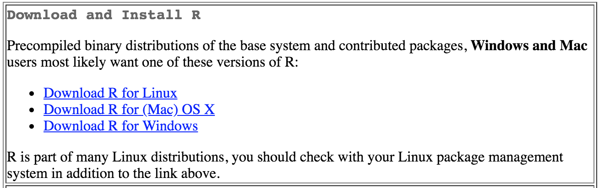

3. Windows Users
    - click on the link `install R for the first time`
    - download the lastest version of R that looks similar to `R-3.5.1` as shown below
    - `Note`: The R version shown below does not distinguish between 32-bit and 64-bit Windows, since two versions are combined into one file to simplify the download. But you would still need to choose one during the installation process (see details below).
  
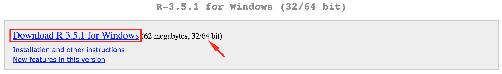


4. Mac Users
    - scroll down to the `Lastest release` section
    - click to download the lastest version that looks similar to `R-3.5.1.pkg`

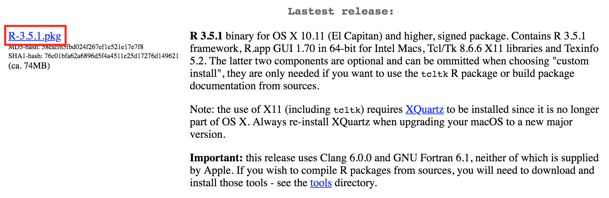

5. Install R
    - `Warning`: We highly recommend you to **use English as the default language** for your R. You will search for help on the internet at some point. It is simply easier to communicate when help seekers and help givers are speaking the same language. 
    - `Warning`: We highly recommend you to **use the default directory (默认路径)** for installation. Third-party packages will look for R. We do not want to make it too hard for them. 
    - For Mac users, the installation process should be straightforward. 
    - For Windows users, you need to find out whether your Windows is a 32-bit or 64-bit system and install the one identical to your system. To find out which version is your Windows, right-click on `我的电脑` -> `属性` -> `系统类型`. This is where you can find the information. 


### Install RStudio

[RStudio](https://www.rstudio.com/) is an IDE (**I**ntegrated **D**evelopment **E**nvironment), a powerful user interface development specifically for R. For individual use, use can download the free open source edition of RStudio. 

`Note`: You can choose to install a [Preview release of RStudio](https://www.rstudio.com/products/rstudio/download/preview/). The preview release has more features than standard release. However, the downloading speed can be painfully slow. In the following, we will demonstrate installation of the standard release. 

1. Go to the [official website for download](https://www.rstudio.com/products/rstudio/download/) and click on the **DOWNLOAD** button for **RStudio Desktop** under the Open Source License, which is completely free. 


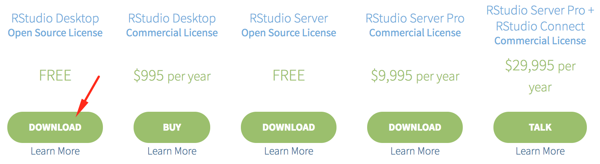

2. Choose the link corresponding to your operating system.  

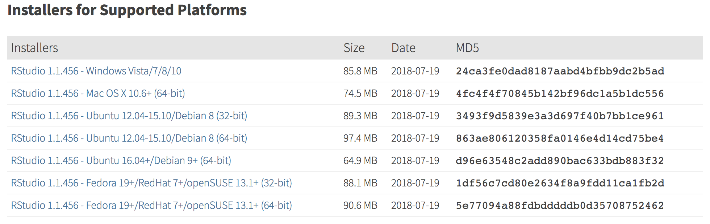

3. Install RStudio

Run the downloaded program and use the **default directory** for installation. The rest of the installation process should be straightfoward.

4. Open RStudio

The first time you open Rstudio, you might encounter the following error message, which suggests that you are not authorized to run the program. 

To address it, right-click on `rstudio.exe` -> `属性` -> `兼容性` -> `以管理员身份运行`. 


5. Change Settings

By default, RStudio is using a CRAN mirror hosted in the US. If you are outside the US (e.g. in China), you may have trouble fetching data/code into R. The solution is to use a local CRAN mirror.  

- after openning RStudio, find `Tools` -> `Global Options` -> `Packages`
- under `CRAN mirror`, click `Change...`
- scroll down the list and select the one mirror that is close to you
- click `OK` to commit the change


Now that you have installed R and RStudio, some additional resources are available. 

- [Take a quick look at R and RStudio](http://stat545.com/block002_hello-r-workspace-wd-project.html): You can checkout other links later. Highly recommend to take a look at this link to familiar yourself with R and RStudio. `TODO`: make a video on this
- [Customizing RStudio](https://support.rstudio.com/hc/en-us/articles/200549016-Customizing-RStudio): It contains more information about changing the default settings of RStudio. You may want to check out the sections on **Source Code** or choose a different Editor theme under **Appearance** to make your RStudio looks different/cooler. 
- [Keyboard Shortcuts](https://support.rstudio.com/hc/en-us/articles/200711853-Keyboard-Shortcuts): Shortcuts are always helpful. This help page actually sits on your own computer already. In RStudio menu, `Tools => Keyboard Shortcuts Help`, which will gives you identical contents.
- [RStudio IDE Documentation](https://support.rstudio.com/hc/en-us/sections/200107586-Using-the-RStudio-IDE): The two external links above are coming from this documentation, which contains much more information regarding varied topics of using RStudio IDE. 
- [RStudio Documentation](https://support.rstudio.com/hc/en-us/categories/200035113-Documentation): Official documentation on varied RStudio^TM^ products, including RStudio IDE and more. 


### Install R Packages

R is an extensible system and many people share useful code they have developed as a package via CRAN and/or GitHub. 

#### Install from CRAN

This is the most commonly used method to install R packages directly from CRAN. In the following, we will install the `ggplot2` package and use it as a running example. 

In the R console, you type 

```
install.packages("ggplot2")
```

Note, the input must be a **string** as enclosed by double quotes `""`. 

This is usually good enough. But to be extra-careful, the `dependencies=TRUE` argument is often added to explicitly tell R to install any additional packages that `ggplot2` requires to run its functions. 

```
install.packages("ggplot2", dependencies = TRUE)
```

By default, `dependencies = NA` means `c("Depends", "Imports", "LinkingTo")`. Setting `dependencies = TRUE` adds `"Suggests"` to the previous list, which tells R to install all the packages needed to run a package, their examples, tests and vignettes.

For more on managing R packages, please refer to the [R Installation and Administration Manual](https://cran.r-project.org/doc/manuals/R-admin.html#Add_002don-packages).

To install multiple packages, e.g., `pck1` and `pck2`, use 

```
install.packages(c("pkg1", "pkg2"), dependencies = TRUE)
```


> **Practice**: Install the following packages that will be required later in the course.   
>
- [ggplot2](https://ggplot2.tidyverse.org/): A good alternative to R's base graphing packages. 
- [plotly](https://plot.ly/r/): A tool that enhances ggplot2 by translating static plots into interactive graphs
- [dygraphs](http://rstudio.github.io/dygraphs/): A graphing tool specifically designed for charting time-series data in R
- [DiagrammeR](http://rich-iannone.github.io/DiagrammeR/docs.html): A tool for creating diagrams and flowcharts using Graphviz and Mermaid
- [rmarkdown](https://rmarkdown.rstudio.com/): 
- [bookdown](https://bookdown.org/yihui/bookdown/): A tool for combining multiple R markdown files into a book
- [shiny](http://shiny.rstudio.com/): An R package to build interactive web apps
- [shinythemes](https://rstudio.github.io/shinythemes/): More themes for shiny apps
- [DT](https://rstudio.github.io/DT/): A tool to create dynamic tables
- [dplyr](https://dplyr.tidyverse.org/): A package to perform data manipulation
>

<br>
The function defined below would (a) check if required packages exist, (b) install, if not already installed, and (c) load the packages.

```{r, eval=FALSE}
force_load <- function(pkgs, use_require=FALSE) {
  # https://gist.github.com/smithdanielle/9913897
  # https://cran.r-project.org/web/packages/install.load/README.html
  new_pkgs <- pkgs[!(pkgs %in% installed.packages()[, "Package"])]
  if (length(new_pkgs)) 
    install.packages(new_pkgs, dependencies = TRUE)
  if (use_require) {
    loaded = sapply(pkgs, require, character.only = TRUE)
  } else {
    loaded = sapply(pkgs, library, character.only = TRUE)
  }
  return(loaded)
}

packages = c("ggplot2", "ggthemes", "rmarkdown", "bookdown", "shiny", "Hmisc")
loaded = force_load(packages)
loaded
```

#### Install from Source Code
Occasionally, you might encounter an error message telling you that the package to be installed requires an R version greater than the one you currently have. You can, of course, choose to re-install R, which might necessitate re-installing all the other packages that are previously installed. What a hassle! Alternatively, you can choose to download the source code for the package and install from the source code directly.

1. In any search engine (e.g. www.baidu.com), search for `CRAN package ggplot2`. This should lead you to the `ggplot2` package hosted on CRAN.

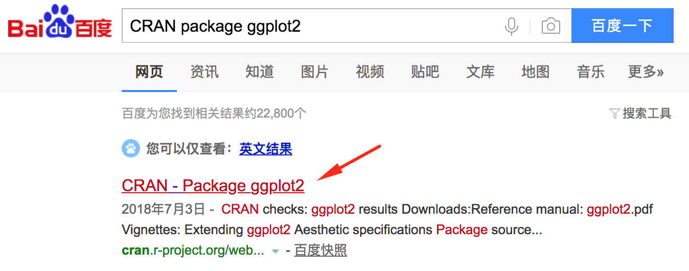

2. Scroll down to the **Downloads** section, next to **Package source**, click on the link to the file that ends with `tar.gz`. Save it under a local directory where you can easily find it.

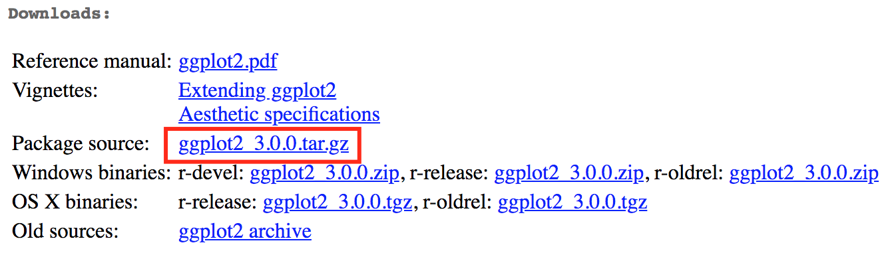

3. In R console, type the following

```
install.packages("download_path/ggplot2_3.0.0.tar.gz", repos = NULL, type = "source")
```

where `download_path` is the directory that stores the downloaded source file. 


#### Commonly Encountered Problems

While installing packages, one type of error messages has the following pattern. 

```
Warning in install.packages :
  error message
```

The specific `error message` you might encounter can be very different from time to time. Some examples are as follows. 
```
Warning in install.packages :
  InternetOpenUrl failed: ''

Warning in install.packages :
  package ‘packagename’ is not available (for R version 3.5.0)

Warning in install.packages :
  unable to access index for repository https://cran.rstudio.com/src/contrib:
  cannot open URL 'https://cran.rstudio.com/src/contrib/PACKAGES'
Installing package into ‘C:/Users/YourUserName/Documents/R/win-library/3.5’
(as ‘lib’ is unspecified)

Warning in install.packages :
  unable to access index for repository https://cran.rstudio.com/src/contrib:
  cannot open URL 'https://cran.rstudio.com/src/contrib/PACKAGES'
```

In your R console, type `getOption("repos")`. If you get the following response, it means that you fail to set a local CRAN mirror. See the **Change Settings** section under **Install RStudio** for the solution. 

```
CRAN 
"https://cran.rstudio.com/" 
attr(,"RStudio")
[1] TRUE
```

### Update R and R Packages

- Update R

The [CRAN solution](https://cran.r-project.org/bin/windows/base/rw-FAQ.html#What_0027s-the-best-way-to-upgrade_003f) is not particularly good. 

- Update R Packages

```
update.packages(ask = FALSE, checkBuilt = TRUE)
```

`Note`: This will only update packages directly installed from CRAN. So if you use a package that lives only on GitHub, you will need to update it manually, e.g. via  `devtools::install_github()`.

### Register a GitHub account

1. Choose a GitHub Username

Choosing a proper GitHub username is **extremely important**. Given the _Username_ you choose, your GitHub account will look like `https://github.com/Username`. This "website" will be the one place to host and showcase all of your coursework. In the information age, when online presence is more important than ever, this is your online portfolio, your "voice", your professional "business card".

Therefore a few tips:

- **Incorporate your actual name**. Using your actual name makes it easier for people to remember. Moreover, people like to know who they are dealing with.
- **Use proper case styles**. You can use **camel case**, e.g. WeChat, FedEx, iPhone, eBay, **snake case**, e.g. wenliang_he, or **kebab case**, e.g. Wenliang-He to introduce complexity into your usernames to avoid conflicts. Please refer to [Special Case Styles](https://en.wikipedia.org/wiki/Letter_case#Special_case_styles) for more informatin. 
- **Use topic words**. If you are creating a themed account posting things for a specific purpose. You can consider using words evocative of a topic, e.g. Wen4Education, GeoStatsNinja.
- **Make it timeless**. Try to avoid using your current school name, employer, or place of residence etc. As things change, your username might become irrelevant.
- **Pick a username you feel comfortable revealing to your future boss**. People are fond of coming up with unique, bold and sassy usernames. But be careful not to go too far.
- **Shorter is better than longer**. This should be obvious.
- **Remove numbers whenever possible**. Try your best to avoid appending random numbers to your username.


`Note`: The tips presented above are adapted from suggestions given by [Jenny Bryan](http://happygitwithr.com/github-acct.html).


You can change your username later, but it's better to get it right the first time. 

- https://help.github.com/articles/changing-your-github-username/
- https://help.github.com/articles/what-happens-when-i-change-my-username/

2. Register a GitHub Account

Go to [GitHub](https://github.com) and register for a free account. By default, a free GitHub account offers only public repositories that are visible and accessible to the general public. To have private repositories, you needs to upgrade to a paid account. 

Here is the good news: For students, faculty, and research staff with `.edu` email accounts, you can upgrade to a [GitHub Education](https://education.github.com/) account that offers free unlimited private repositories. Rejoice and enjoy!


### Install Git

#### Windows Users

Install **Git for Windows**, also known as `msysgit` or "Git Bash", which installs Git along with other useful tools, such as the Bash shell. 

1. Download the **Git for Windows** installer
    - Go to [gitforwindows.org](https://gitforwindows.org/) and press Download.
    - On the download page, click on either the 32-bit or 64-bit version depending on your Windows system. The latest version by the time of writing this guide is v2.19.0. 

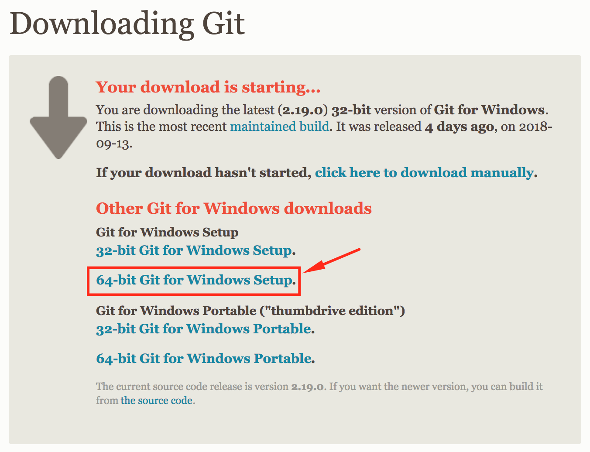{width=500}

`NOTE`: You can also go to [git-scm.com](https://git-scm.com/download/win) and the download would automatically start. However, it will download the 32-bit version by default, which is inconvenient if you want the 64-bit one. It does not matter which link you use, since the two would eventually go to the same place fetching for the same installation program. 

2. Run the installer and follow the steps below
    1. Click "Next"
    1. Click "Next"
    1. Click "Next"
    1. Click "Next"
    1. Click "Next"
    1. Select **"Use Git from the Windows Command Prompt"** and click "Next". It's critical that you select this. Otherwise, you need to rerun the installer. 
    1. Click "Next". Keep "Checkout Windows-style, commit Unix-style line endings" selected.
    1. Select **"Use Windows' default console window"** and click "Next".
    1. Click "Next"
    1. Click "Finish"

Please use the default `C:/Program Files`, which makes it easier for RStudio to find Git. 

During Git installation, select "Enable Git Credential Manager". 

```{r eval=FALSE, echo=FALSE}
# https://cfss.uchicago.edu/git01.html
# http://happygitwithr.com/install-git.html

```


#### Mac Users

Since Bash shell is included in Mac OS, you only need to download and install Git. 

- Download Git installer from [git-scm.com](https://git-scm.com/download/mac).

- Installation should be straightfoward for Mac users. 

If the download does not automatically start, click the link as highlighted in the graph below. 
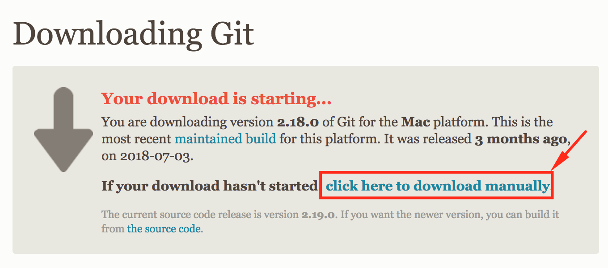{width=500}


#### Configure Git

After installation, your need to configure your Git. You only need to do this once.

Open shell and type the following commands into shell and press Enter. Please make sure that you have changed the code accordingly based on your personal information. For example, `your-first-name` should be really your first name. 

```
git config --global user.name "your-first-name your-last-name"   # set user.name
git config --global user.email "your-github-email"               # set user.email
git config --global core.editor "nano"                           # set text editor
git config --global --list                                       # check settings

```

- **open shell**
    - **easiest way**: For Windows and Mac, in RStudio, go to _Tools > Shell..._ 
    - **another way**: For Windows, open a new program called Git Bash. You have just installed it while installing Git. 
    - **another way**: For Mac, go to _Finder_ > _Command + Option + Space_ > type `terminal` and press Enter

- **set user.name**: `git config --global user.name "your-first-name your-last-name"`
    - The `your-first-name your-last-name` is a Git username, **NOT** your GitHub username. It can be any name you want (in this course, however, please observe the first-name-last-name convention, which is informative for others). Git uses it to associate commits with an identity such that others can see which commit is made by which user. Changing a Git username affects future commits, not past commits. 

- **set user.email**: `git config --global user.email "your-github-email"`
    - The `your-github-email` **must** be your GitHub email. This email is officially called **Git commit email address**. GitHub uses it to associate commits with your GitHub account such that GitHub knows if it should allow a certain commit to be pushed to a specific GitHub account. 

- **set text editor**: `git config --global core.editor "nano"`
    - Set your default Git text editor to be nano, a light-weight easy to use text editor that comes with both Windows and Mac OS. Git may use Vim by default, which is powerful, but not the easiest editor to use. 

- **check settings**: `git config --global --list`
    - Check to ensure everything is set correctly.


## Introduction to R


### Essential Basics {#r-basics}

In R, every method is a function: `name` + `()`. For example, in your R console, try type `help()`. 

### Atomic Data Types {#atomic-dtype}

There are four commonly used atomic data types. 

- logical: e.g. TRUE, FALSE
- integer: e.g. -2, 0, 1, 2
- numeric: e.g., -2.0, 0.05, 1.2
- character: e.g., "-2.0", "cat", "dog"

#### Logical {#logical}

Logical is simply `TRUE` or `FALSE`. To note, `T` is a shorthand for `TRUE`. They are strictly identical. 

```{r}
TRUE
T
```

To check the data type of `TRUE`, use the `class()` function.
```{r}
class(TRUE)
class(T)
```

To note, you **MUST NOT** use `True` or `False`, which would result in an error. 
```{r, error=TRUE}
True
```


#### Integer {#integer}

If you directly type `2` into the R console, you might think it's an integer, but it is in fact of numeric data type. To note, numeric data type is also called **floating point** in other programming languages. 

```{r}
2; class(2)
```

The `;` sign is used to separate commands such that two lines can be written succinctly in one line. In our case, ```2; class(2)``` is identical to 

```{r, eval=FALSE}
2
class(2)
```

To have an integer, you can attach an `L` to the integer. 
```{r}
2L; class(2L)
```

#### Numeric {#numeric}
Numeric is synonymous to floating point.

```{r}
2.0; class(2.0)
```

#### Character {#character}
Character is synonymous to string.

```{r}
"hi there"; class("hi there")
```

To note: Any things if it has double quotes, it must be characters.
e.g.
```{r}
class("2.0")
```

Data type precedence: logical < integer< numeric < character
And they can be converted to each other.
We can see these examples:

```{r}
as.integer(2) 			                # as.integer() converts values to integer
class(as.integer(2)) 				        # integer
as.integer(TRUE) 					          # convert logical to integer
as.numeric(TRUE) 					          # convert logical to numeric
as.logical(100)                   	# convert numeric to logical
                                    # TRUE is for 1; FALSE is for 0.
as.character(1.2) 					        # convert numeric to character
```

**Conclusion**: as.+ data type () means what we want convert to.

### R Object Types {#object-types}

There are four basic object types in R.

#### Vector {#vector}

Vector is the workhorse of R computing. Elements of a vector MUST be of the same dtype.

```{r}
var1 = c(1, 2, 3, 4)              # var1 is a vector, it includes numbers 1,2,3,4
                                  # c() is a function, where c stands for concatenate
var2 = 1:4	                      # practically identical
```

```{r}
var3 = c('a','b','c','d')				    # create a third vector of a different dtype
var3 = letters[1:4] 					      # identical
```

To check the data type of vector's elements, use `class()` too.

```{r}
class(var1); class(var2)				    
```

A vector has a length, can use `length()` to get.
```{r}
length(var1); length(var1)	
```

Remember: logical < numeric < character
```{r}
c(TRUE, 2) 							           
c(TRUE, 2, 3.0) 						        
c(TRUE, 2, 3.1) 						        
c(TRUE, 2, 3.1, 'four') 				   
```

Concatenating vectors gives a vector.

Remember to follow the same dtype precedence rule
```{r}
c(var1, var2) 						          
c(var1, var3) 						          
```

Vectors can ????????????

```{r}
var1 + var2							            # vectorized operation operates on each element
var1 == 3							              # '==' means 'compare' and '=' means 'assign'
```

**Broadcasting**: When operate with vectors of different lengths,the shorter vector is recycled to the full length, this is called broadcasting.

```{r}
var1 + c(1, 2)						         
var1 + 2								           
```

To note: vectors interact with one element only works if one is multiple times longer than the other.

```{r}
var1 + 1:3 					              
```

#### Matrix {#matrix}
Matrix is xxx

A matrix should have only one data type.

We can bind vectors of same length and **same** data type gives a matrix.

```{r}
mat1 = cbind(var1, var2);mat1
```

We can see the data type and dimension of the matrix, the dtype will change to the upper dtype.
```{r}
class(mat1)							          
dim(mat1)							              # 4 rows, 2 column
```

If we bind vectors of same length, different dtype.
```{r}
mat2 = cbind(var1, var3);mat2       # numeric changed to character
```

#### Dataframe {#dataframe}

Binding vectors of same length, **different** dtypes gives a dataframe.

Use `data.frame()` function.
```{r}
dat = data.frame(var1, var3);dat
```

Check the class and the dimension of the data.frame.

Hint: a dataframe is essentially a dataset.
```{r}
class(dat)							            
dim(dat)								    
```

#### List {#list}

Binding any objects gives a list.
```{r}
lst = list(var1, var3, mat1, dat);lst
class(lst); length(lst) 				                    # a list class with 4 elements
```

### Indexing {#indexing}

In R, `any_name[]` implies `any_name` is an object, and `[]` implies calling out values from objects.

#### Indexing Vectors {#index-vec}

 - Indexing by position
```{r}
var3[1]								              # single selection; select the first element
var3[length(var1)] 					        # single selection; select the last element
var3[c(1,1,3,4)]						        # multiple selection
var3[2:4] 							            # slicing
var3[-1]								            # reverse single selection; select all but the first
var3[-length(var1)]					        # reverse single selection; select all but the first
var3[c(1,1,3,4)]						        # reverse multiple selection; all but the specified
var3[-c(2:4)]							          # reverse slicing; MUST NOT var[-2:4]
```

 - Indexing by name
```{r}
names(var1) = letters[1:4]; var1			    # give names to each element of a vector
var1 = c(a=1, b=2, c=3, d=4); var1        # identical
var1[1]; var1["a"]                        # call out the first element
var1[c('a', 'a', 'c', 'd')]			          # identical to var1[c(1,1,3,4)] with more typing
var1[[1]]; var1[["a"]]                    # notice the difference with var1[1] or var1["a"]
unname(var1[[1]]); unname(var1[["a"]])    # identical
```

 - Indexing by a logical vector
```{r}
idx = var1 <= 2; idx 						    # create an index vector of the logical dtype
var1[idx] 						 	            # call out values according to the index vector
var3[idx] 							            # call out values according to the index vector
```

#### Indexing Matrices/Dataframes {#index-matdat}

 - Indexing by position
 
`matrix/dataframe[row_indices, column_indices]`
```{r}
dat[1:3, 1]							            
dat[c(1,3), ]							          # select the 1st and 3rd rows only
dat[, c(1,1,2)]						          # select 1st column twice, 2nd once
```

 - Indexing by name
```{r}
colnames(dat) = c("id", "group")		# give column names to our dataframe
rownames(dat) = letters[1:4]			  # give row names to our dataframe
dat[c('a', 'b', 'c'), "id"]					# identical to dat[1:3, 1]
dat[c('a', 'c'), ]						      # identical to dat[c(1,3), ]
dat[,c("id","id","group")]				  # identical to dat[, c(1,1,2)]
```

 - Index rows by position, columns by name
```{r}
dat[1:3, "id"] 						          
dat[,1]; dat[,"id"]						      # return a vector that is the 'id' column
dat$id 								              # identical; '$' sign is a shorthand
dat$i; dat$g                        # "$" sign does partial matching
dat[[1]]; dat[["id"]]               # identical
dat[1]; dat["id"] 						      # return a data.frame with 'id' as the only column
dat[,1,drop=F]; dat[,"id",drop=F]   # identical
```

#### Indexing Lists {#index-lst}

- Indexing by position
```{r}
lst[1]							                # return a list with the first object
lst[1:2] 							              # return a list with the first two objects
lst[[1]] 							              # return var1
lst[[1]][1]						              # select 1st element in the 1st object
lst[[c(1,1)]]                       # identical
lst[[2]][3]						              # select 3rd element in the 2nd ojbect
lst[[c(2,3)]]                       # identical
```

- Indexing by name
```{r}
names(lst) 							            # NULL indicates no names
names(lst) = c("var1","var3","mat1","dat") 	# give names to the list
lst[["var3"]] 						          # calling out contents of the cell called "var3"
lst$var3 							              # identical; '$' sign is a shorthand
```

- Indexing by a logical vector
```{r}
lst[c(T, T, F, F)] 						      # same idea applied to calling contents from lists
```

### Factors {#factor}

Factor is special data type.

Continuous/ordinal variables as numeric vectors;categorical variables as character vectors

[Tutorial on factors]( http://www.ats.ucla.edu/stat/r/modules/factor_variables.htm)

```{r}
# fac = dat[,"var3"]; fac					      # storing character vectors in dataframes
                                      # gives us factor variables/vectors (a.k.a. factors)
fac = factor(var3); fac					      # identical; convert character vectors into factors
class(fac)							              # 'factor'
levels(fac)							              # levels of a factor variable is its categories
fac[1]
fac[1, drop=TRUE]
```


## Introduction to R Markdown

```{r, echo=FALSE}
library(emo)
library(DiagrammeR)

mermaid("
graph LR
MU(Markup) --> MD(Markdown) 
MD --> PDMD(Pandoc Markdown)
MD --> GHMD(GitHub Markdown)
MD --> PHPMD(PHP Markdown)
PDMD --> RMD(R Markdown)
RMD --> BD(Bookdown)
", height=200)
```

There are some resources for learning Markdown, GitHub Markdown, and R Markdown. 

**Markdown Tutorials**

- [eherrera.net](http://eherrera.net/markdowntutorial/): a fast way to learn Markdown basics plus an interactive tutorial
- [markdown guide - basics](https://www.markdownguide.org/basic-syntax): a more detailed Markdown tutorial juxtaposing _code_ and _effect_
- [markdown guide - extended](https://www.markdownguide.org/extended-syntax): more contents in addition to the basics
- [gitlab.com](https://about.gitlab.com/handbook/product/technical-writing/markdown-guide/): a much more detailed tutorial on Markdown
- [emoji cheatsheet](https://www.webpagefx.com/tools/emoji-cheat-sheet/): a great resource for looking up **emoji** `r emo::ji("smile")`, which can be used in GitHub Markdown and R Markdown


**R Markdown Tutorials**

- [Jacolien's blog](http://www.jacolienvanrij.com/Tutorials/tutorialMarkdown.html): a simple R Markdown tutorial
- [rstudio.com - basics](https://rmarkdown.rstudio.com/articles_intro.html): a quick intro to R Markdown, similar in difficulty to Jacolien's tutorial
- [rstudio.com - detailed](https://rmarkdown.rstudio.com/lesson-1.html): the official R Markdown tutorial with more details


### Basic Markdown

The following contents are adapted from 

- [Introduction to Markdown by RStudio](https://rmarkdown.rstudio.com/authoring_basics.html)
- [James Steiger's Blog](http://www.statpower.net/Content/310/R%20Stuff/SampleMarkdown.html)
- [Archer's blog](http://csrgxtu.github.io/2015/03/20/Writing-Mathematic-Fomulars-in-Markdown/)


Before we proceed to learn the Markdown and R Markdown languages. Let us install the [editR](https://github.com/swarm-lab/editR) package first. editR is a R Markdown editor with instant previewing capacity such that you do not have to repeatedly `knit` it to see the outcome. 

In your R console, type
```
if (!require("devtools")) install.packages("devtools")
devtools::install_github("trestletech/shinyAce")
devtools::install_github("swarm-lab/editR")
```

After the package is properly installed, run the following code in your R console. 
```
library(editR)
editR()
```

An interactive prompt will come up and you can use it to open .Rmd files in the same way you would use Microsoft Office to open .docx files. Enjoy the instant previewing. 

Raw code for the following contents can be found [here](code/rmarkdown.Rmd).

#### Headers

```
# Header 1
## Header 2
### Header 3
#### Header 4
##### Header 5
##### Header 6
```

Actual code is removed, because it will mess up header indexing. 


<br>

#### Texts in Markdown

**Intervening Spaces**

```
White spaces between texts do nothing in R Markdown.        Eight whitespaces (or four Tabs)
and a newline have no effect. 
```

White spaces between texts do nothing in R Markdown.        Eight whitespaces (or four Tabs)
and a newline have no effect. 


**Two or More Trailing Spaces**

```
However, adding two or more trailing spaces by the end of the line  (two spaces are here!)
would break the line.
```

However, adding two or more trailing spaces by the end of the line  
would break the line. 


**Intervening Newlines**

```
If there is a newline in between,

it will create a new paragraph. 
```

If there is a newline in between,

it will create a new paragraph. 


#### Code & Quotes {#codequote}


**Inline Code**

Inline code such as `x = x+1` can be created by wrapping some text with one backstick sign \` at each end of the equation x = x+1.  

Characters within _inline code_ lose their meaings and are dispalyed verbatim. 

**Code Blocks**

To create a **code block** (aka **code in display mode**), as shown below, surround multiple lines of code with three backstick signs at the preceding and succeding lines. 

```
x = 1
y = x + 1
answer = y * 2
```

Characters within _code blocks_ lose their meanings and are displayed verbatim (see an exception at [Including R Code & Result](#rcode)). We have been using code blocks all along in the previous sections to contrast snippets of raw code with their effect. 


**Block Quotes**

Block quotes follow the same three rules regarding (a) intervening spaces, (b) two trailing spaces, and (c) intervening newlines. The quote below is credited to Sarah Ban Breathnach, a New York Times best-selling author. 

```
> The world needs dreamers and the world needs        doers. 
But above all the world needs dreamers who do. 
```

> The world needs dreamers and the world needs        doers. 
But above all the world needs dreamers who do. 

```
> The world needs dreamers and the world needs doers.  (two spaces are here!)
But above all the world needs dreamers who do. 
```

> The world needs dreamers and the world needs doers.  
But above all the world needs dreamers who do. 

```
> The world needs dreamers and the world needs doers.

> But above all the world needs dreamers who do. 
```

> The world needs dreamers and the world needs doers.

> But above all the world needs dreamers who do. 

Wait a second, an intervening newline breaks the quote bar. Fix it by adding a `>` in between the two bars to join them together. 

```
> The world needs dreamers and the world needs doers.
>
> But above all the world needs dreamers who do. 
```

> The world needs dreamers and the world needs doers.
>
> But above all the world needs dreamers who do. 


#### Emphasis

The table below contrast code and its effect. 

|Code|Effect|Note|
|:---|:---:|---|
|`_italic_`|_italic_| recommened |
|`*italic*`|*italic*| `*` and `_` are identical |
|`__bold__`|__bold__|
|`**bold**`|**bold**| recommened |
|`___italic-and-bold___`|___italic-and-bold___|
|`***italic-and-bold***`|***italic-and-bold***|
|`**_italic-and-bold_**`|**_italic-and-bold_**| recommended |
|`~~strikethrough~~`|~~strikethrough~~|
|`X~i~`|X~i~| subscript |
|`X^2^`|X^2^| superscript |
|`X~i~^2^`|X~i~^2^| subscript followed by superscript |
|`X^2^~i~`|X^2^~i~| superscript followed by subscript |


**Horizontal Rule**

Three or more asterisks or dashes create a _horizontal rule_, aka **page break**. 

```
***
```

***

or 

```
---
```

---

#### Links

**Links to Websites**

Links can be either naked or in the form of `[mandatory text](http://somesite.com "optional hover message")`. Operative links must start with `http` or `https`.

```
www.baidu.com

https://www.baidu.com/

[](https://www.baidu.com/)    # no mandatory text, no links whatsoever

[Baidu Search Engine - malfunctioning](www.baidu.com "This link would not work")

[Baidu Search Engine - functioning](https://www.baidu.com/ "This link would work")

```

www.baidu.com

https://www.baidu.com/

[](https://www.baidu.com/)

[Baidu Search Engine - malfunctioning](www.baidu.com "This link would not work")

[Baidu Search Engine - functioning](https://www.baidu.com/ "This link would work")


**Links to Images**

Images on the web or local disks can be loaded in the form of ` "optional hover message"`. The caption is completely optional. 

RStudio(TM)


```
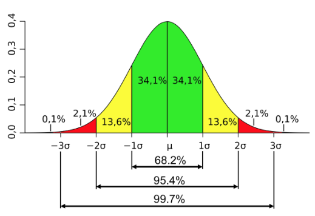


```


**Reference-style Links**

```
Hover to see [where this link directs you][id].

[id]: http://www.baidu.com "This is Baidu.com"

This graph represents a well-known rule in statistics:
![caption not displayed due to absence of line break][id2]

[id2]: images/intro_rule.png "This is the 68-95-99.7 Rule"
```


Hover to see [where this link directs you][id].

[id]: http://www.baidu.com "This is Baidu.com"


This graph represents a well-known rule in statistics:
![caption not displayed due to absence of line break][id2]

[id2]: images/intro_rule.png "This is the 68-95-99.7 Rule"


#### Unordered Lists

- Start an unordered list with any one of `-`, `+`, or `*`. They are **completely identical**. 
- To create nested sub-lists, indent with **four spaces** (or hitting the `tab` key twice to create the equivalent of four spaces). 
- Unordered lists only work for **two or three levels**, depending on your output format, i.e., html, pdf, or docx. 

To emphasize again, using any one of `-`, `+`, or `*` would give completely identical result. 

```
- item1
- item2
    - item2.1
    - item2.2
        - item2.2.1
        - item2.2.2
            - item2.2.2.1
            - item2.2.2.2
```

- item1
- item2
    - item2.1
    - item2.2
        - item2.2.1
        - item2.2.2
            - item2.2.2.1
            - item2.2.2.2


#### Ordered Lists

| type | works | fails |
|---|---|---|
| arabic numerals | `1.` or `(1)` | `1` or `(1).` |
| English alphabet | `a.` or `(a)` | `a` or `(a).` |
| roman numerals | `i.` or `(i)` | `i` or `(i).` |

To note, you can of course mix ordered lists with unordered lists. 

```
2. Item 1
9. Item 2
8. Item 3
    (3) Item 3.1
    (1) Item 3.2
7. Item 4
(4) Item 5
(1) Item 6
(1) Item 7
    2. Item 7.1
    1. Item 7.2
```

2. Item 1
9. Item 2
8. Item 3
    (3) Item 3.1
    (1) Item 3.2
7. Item 4
(4) Item 5
(1) Item 6
(1) Item 7
    2. Item 7.1
    1. Item 7.2

The same rules apply to **English alphabet** and **Roman numerals**.

```
b. Item 1
d. Item 2  
c. Item 3  
    (c) Item 3.1
    (a) Item 3.2
z. Item 4
(c) Item 5
(a) Item 6  
(a) Item 7
    b. Item 7.1
    b. Item 7.2
```

b. Item 1
d. Item 2  
c. Item 3  
    (c) Item 3.1
    (a) Item 3.2
z. Item 4
(c) Item 5
(a) Item 6  
(a) Item 7
    b. Item 7.1
    b. Item 7.2


```
ii. Item 1
iv. Item 2  
viii. Item 3  
    (iii) Item 3.1
    (i) Item 3.2
vii. Item 4  
(iv) Item 5 
(i) Item 6
(i) Item 7
    ii. Item 7.1
    i. Item 7.2
```

ii. Item 1
iv. Item 2  
viii. Item 3  
    (iii) Item 3.1
    (i) Item 3.2
vii. Item 4  
(iv) Item 5 
(i) Item 6
(i) Item 7
    ii. Item 7.1
    i. Item 7.2


#### Tables

```
|order|name|producing area|price|
|---|:---|---:|:---:|
|1|banana|hainan|2￥/kg|
|2|apple|baishui|4￥/kg|
|3|mango|zhangzhou|8￥/kg|
|4|watermelon|jinhua|1￥/kg|
```


|order|name|producing area|price|
|---|:---|---:|:---:|
|1|banana|hainan|2￥/kg|
|2|apple|baishui|4￥/kg|
|3|mango|zhangzhou|8￥/kg|
|4|watermelon|jinhua|1￥/kg|


### R Markdown


#### Including R Code & Result {#rcode}

- In Markdown, one backstick sign \` indicates inline code and three represent code blocks. 

- Similarly, in R Markdown, we can include R code and result directly using one backstick \` to introduce inline code and three for code blocks. 

**Inline Code**

Placing an `r` **immediately** after the first backstick sign \` creates inline R code that will always be evaluated, showing only result but not code. 

R has numerous datasets loaded automatically when it is opened. In your console, use the `data()` function to inspect available datasets. We will use the popular **iris** dataset as an example here. 

In the console, if you type `iris` and press Enter, you will see the contents of the iris dataset. If you want to show the number of rows in the iris datasets, you can type `nrow(iris)`. Then you can report the result as follows. This is OK, but you will have to actually take a look at the result of `nrow(iris)`. Instead, we can use incline code. 

```
The iris dataset has 150 rows. 
```

The iris dataset has 150 rows. 


```
The iris dataset has `_r nrow(iris)` rows.
```

The iris dataset has `r nrow(iris)` rows. 

`NOTE`: The underscore sign _ has to be added, or else `nrow(iris)` will be evaluated in the code block, which is an exception to the rule discussed at [Code & Quotes](#codequote). 


**Code Blocks**

Placing an `{r}` **immediately** after the first three backstick signs creates an R code block. By default, the code block will be evaluated, showing the code and the result. 


```{r}
summary(cars)
```


```{r}
plot(cars)
```

You can control whether to evaluate the code (and hence show the result) or to show the code by changing the `eval` and `echo` arguments. 

| ID | show code | show result | argument | note |
|---|---|---|---|
|A|Yes|Yes| `{r eval=TRUE, echo=TRUE}` | the default|
|B|Yes|No| `{r eval=FALSE, echo=TRUE}` |
|C|No|Yes| `{r eval=TRUE, echo=FALSE}` |
|D|No|No| `{r eval=FALSE, echo=FALSE}` |

A
```{r eval=TRUE, echo=TRUE}
summary(cars)
```

B
```{r eval=FALSE, echo=TRUE}
summary(cars)
```

C
```{r eval=TRUE, echo=FALSE}
summary(cars)
```

D
```{r eval=FALSE, echo=FALSE}
summary(cars)
```


### Mathematical Symbols in Latex

There are two ways to introduce mathematical equations formatted by **Latex**.

- using `$` for introducing inline equations, e.g. `$x+1$` gives $x+1$
- using `$$` for presenting stand-alone equations in display mode, e.g. `$$x+1$$` gives $$x+1$$

#### Texts

Surrounded within `$` or `$$` sign, whitespaces lose their meaning. Must use `~` or `\,` to denote a whitespace. For the sake of clarity, use `~` whenever applicable. Note, `~` gives slightly bigger space than `\,`, but who cares.

```
$$ab, a b, a    b, a~b, a\,b, a~~b, a\,\,b, a~~~b, a\,\,\,b$$
```

$$ab, a b, a    b, a~b, a\,b, a~~b, a\,\,b, a~~~b, a\,\,\,b$$

By default, texts within `$` are italized. You will have to use special Latex commands to ask for regular non-italized fonts. 

```
$$ abc, \text{abc}, \boldsymbol{abc}, \mathbf{abc}, \exp(x), \sin, \cos, \lim $$
```

$$ abc, \text{abc}, \boldsymbol{abc}, \mathbf{abc}, \exp(x), \sin, \cos, \lim $$


|Code|Effect|Note|
|---|---|---|
|`$abc$`|$abc$| text is italicized by default |
|`$\text{abc}$`|$\text{abc}$| non-italicized font | 
|`$\boldsymbol{abc}$`|$\boldsymbol{abc}$| bold and italicized |
|`$\mathbf{abc}$`|$\mathbf{abc}$| bold and non-italicized font|
|`$\exp(x)$`|$\exp(x)$| exponentiate |
|`$\sin$`|$\sin$| sine |
|`$\cos$`|$\cos$| cosine |
|`$\lim$`|$\lim$|

#### Greek Letters

|Code|Effect|Note|
|---|---|---|
|`$\alpha$`|$\alpha$|
|`$A$`|$A$|
|`$\beta$`|$\beta$|
|`$\gamma$`|$\gamma$|
|`$\Gamma$`|$\Gamma$|
|`$\delta$`|$\delta$|
|`$\Delta$`|$\Delta$|
|`$\pi$`|$\pi$|
|`$\Pi$`|$\Pi$|
|`$\phi$`|$\phi$|
|`$\Phi$`|$\Phi$|
|`$\varphi$`|$\varphi$|
|`$\theta$`|$\theta$|

#### Algebraic Representation

```
$$ x_i, x_{ij}, x_{i+1}, x^2, x^{2/3}, x_i^2, x^2_i, \sqrt{x}, \sqrt[^n]{x}, \frac{2}{3}, \binom{n}{k} $$
```

$$ x_i, x_{ij}, x_{i+1}, x^2, x^{2/3}, x_i^2, x^2_i, \sqrt{x}, \sqrt[^n]{x}, \frac{2}{3}, \binom{n}{k} $$


|Code|Effect|Note|
|:---|:---|:---|
|`$x_i$`|$x_i$| subscript |
|`$x_{ij}$`|$x_{ij}$| must use `{}` with more than one character |
|`$x_{i+1}$`|$x_{i+1}$| another example |
|`$x^2$`|$x^2$| superscript |
|`$x^{2/3}$`|$x^{2/3}$| another example |
|`$x_i^2$`|$x_i^2$| subscript and superscript |
|`$x^2_i$`|$x^2_i$| superscript and subscript (identical; order does not matter) |
|`$\sqrt{x}$`|$\sqrt{x}$| square root |
|`$\sqrt[^n]{x}$`|$\sqrt[^n]{x}$|
|`$\frac{2}{3}$`|$\frac{2}{3}$| fraction |
|`$\binom{n}{k}$`|$\binom{n}{k}$| binomial coeffcient |


#### Algebraic Operations

```
$$ \times, \div, \pm, \mp, \ne, \le, \ge, \ll, \gg, \approx, \sim, \equiv, \cong, \propto, \infty $$
```

$$ \times, \div, \pm, \mp, \ne, \le, \ge, \ll, \gg, \approx, \sim, \equiv, \cong, \propto, \infty $$


|Code|Effect|Note|
|:---|:---|---|
|`$\times$`|$\times$| multiplication sign |
|`$\div$`|$\div$| division sign |
|`$\pm$`|$\pm$| plus and minus |
|`$\mp$`|$\mp$| minus and plus |
|`$\ne$`|$\ne$| not equal |
|`$\le$`|$\le$| less than or equal to |
|`$\ge$`|$\ge$| greater than or equal to |
|`$\ll$`|$\ll$| much less than |
|`$\gg$`|$\gg$| much greater than |
|`$\approx$`|$\approx$| approximate to |
|`$\sim$`|$\sim$| similar to |
|`$\equiv$`|$\equiv$| equivalent to |
|`$\cong$`|$\cong$| 
|`$\propto$`|$\propto$| proportion to |
|`$\infty$`|$\infty$| infinity |

#### Set Operations

```
$$ \forall, \exists, \nexists, \cup, \cap, \in, \ni, \emptyset $$
```

$$ \forall, \exists, \nexists, \cup, \cap, \in, \ni, \emptyset $$

|Code|Effect|Note|
|---|---|---|
|`$\forall$`|$\forall$|
|`$\exists$`|$\exists$|
|`$\nexists$`|$\nexists$|
|`$\cup$`|$\cup$|
|`$\cap$`|$\cap$|
|`$\in$`|$\in$|
|`$\ni$`|$\ni$|
|`$\emptyset $`|$\emptyset$|


#### Calculus Symbols

$$ \sum, \prod, \partial{x}, \int,    $$

|Code|Effect|Note|
|---|---|---|
|`$\sum$`|$\sum$|
|`$\prod$`|$\prod$|
|`$\coprod$`|$\coprod$|
|`$\partial{x}$`|$\partial{x}$|
|`$\int$`|$\int$|
|`$\int x \,\mathrm{d}x$`|$\int x \,\mathrm{d}x$|
|`$\oint$`|$\oint$|
|`$\iint$`|$\iint$|
|`$\idotsint$`|$\idotsint$|
|`$\int_a^b$`|$\int_a^b$|
|`$\int\limits_a^b$`|$\int\limits_a^b$|


#### Statistics & Linear Algebra Symbols

```
$$ \overset{iid}{\sim}, \underset{(1)}{=}, \underset{\text{below}}{\overset{\text{above}}{=}} $$
```

$$ \overset{iid}{\sim}, \underset{(1)}{=}, \underset{\text{below}}{\overset{\text{above}}{=}} $$

```
$$  \therefore, \cdot, \cdots, \dots, \ldots, \vdots, \ddots, \bullet, \dot A, \dot \forall $$
```

$$  \therefore, \cdot, \cdots, \dots, \ldots, \vdots, \ddots, \bullet, \dot A, \dot \forall $$


|Code|Effect|Note|
|---|---|---|
|`$\hat{a}$`|$\hat{a}$|
|`$\bar{a}$`|$\bar{a}$|
|`$\vec{a}$`|$\vec{a}$|
|`$\overset{iid}{\sim}$`|$\overset{iid}{\sim}$|
|`$\underset{(1)}{=}$`|$\underset{(1)}{=}$|
|`$\underset{b}{\overset{a}{=}}$`|$\underset{b}{\overset{a}{=}}$|
|`$\cdot$`|$\cdot$|
|`$\cdots$`|$\cdots$|
|`$\dots$`|$\dots$|
|`$\ldots$`|$\ldots$|
|`$\vdots$`|$\vdots$|
|`$\ddots$`|$\ddots$|
|`$\bullet$`|$\bullet$|
|`$\dot A$`|$\dot A$|
|`$\dot\forall$`|$\dot\forall$|
|`$\therefore$`|$\therefore$|
|`$\overrightarrow{AB}$`|$\overrightarrow{AB}$|
|`$\overline{aaa}$`|$\overline{aaa}$|
|`$\bigoplus$`|$\bigoplus$|
|`$\bigotimes$`|$\bigotimes$|
|`$\bigodot$`|$\bigodot$|
|`$\bigotimes$`|$\bigotimes$|
|`$\biguplus$`|$\biguplus$|
|`$\bigsqcup$`|$\bigsqcup$|
|`$\bigvee$`|$\bigvee$|
|`$\bigwedge$`|$\bigwedge$|


#### Other Mathematical Symbols

|Code|Effect|Note|
|---|---|---|
|`$\nabla$`|$\nabla$|
|`$\grave{a}$`|$\grave{a}$|
|`$\acute{a}$`|$\acute{a}$|
|`$\dot{a}$`|$\dot{a}$|
|`$\ddot{a}$`|$\ddot{a}$|
|`$\ddot{a}$`|$\ddot{a}$|
|`$\mathring{a}$`|$\mathring{a}$|
|`$\check{a}$`|$\check{a}$|
|`$\underline{aaa}$`|$\underline{aaa}$|
|`$\to$`|$\to$|
|`$\rightarrow$`|$\rightarrow$|
|`$\gets$`|$\gets$|
|`$\leftarrow$`|$\leftarrow$|
|`$\uparrow$`|$\uparrow$|
|`$\downarrow$`|$\downarrow$|
|`$\leftrightarrow$`|$\leftrightarrow$|
|`$(a)$`|$(a)$|
|`$[a]$`|$[a]$|
|`$\langle f \rangle$`|$\langle f \rangle$|
|`$\lfloor f \rfloor$`|$\lfloor f \rfloor$|
|`$\lceil f \rceil$`|$\lceil f \rceil$|
|`$\ulcorner f \urcorner$`|$\ulcorner f \urcorner$|

#### Matrices

- a matrix begins with `\begin{array}` and ends with `\end{array}`
- we use the code `{rrr}` to indicate that each column is right justified
- cells are separated by the `&` symbol
- each line (except the last) is terminated by `\\`

```
$$
\begin{array}
{rrr}
1 & 2 & 3 \\
4 & 5 & 6 \\
7 & 8 & 9
\end{array}
$$
```

$$
\begin{array}
{rrr}
1 & 2 & 3 \\
4 & 5 & 6 \\
7 & 8 & 9
\end{array}
$$

In math textbooks, matrices are often surrounded by brackets, and are assigned to a boldface letter.  Here is an example

```
$$
\mathbf{X} = \left[\begin{array}
{rrr}
1 & 2 & 3 \\
4 & 5 & 6 \\
7 & 8 & 9
\end{array}\right]
$$
```

$$
\mathbf{X} = \left[\begin{array}
{rrr}
1 & 2 & 3 \\
4 & 5 & 6 \\
7 & 8 & 9
\end{array}\right]
$$


#### Practice

Try to reproduce the code for the following formulas. 

```
$$\sum_{i=1}^{n}\left( \frac{X_i}{Y_i} \right)$$
```
$$\sum_{i=1}^{n}\left( \frac{X_i}{Y_i} \right)$$

Hint: In LaTeX, you can create parentheses, brackets, and braces which size themselves automatically to contain large expressions. You do this using the `\left` and `\right` operators.  Here is an example


```
$$ \sum_{i=1}^{n} (X_i - \bar{X})(Y_i - \bar{Y}) $$
```
$$ \sum_{i=1}^{n} (X_i - \bar{X})(Y_i - \bar{Y}) $$

```
$$\int_0^{2\pi} \sin x~dx$$
```
$$\int_0^{2\pi} \sin x~dx$$


## Introduction to Git & GitHub

Git is a version control system. When a **folder** (or **directory**) on your local computer is monitered by Git, the folder is now called a Git **repository** (or Git **repo** for short).

GitHub hosts your local Git repos on the internet.

### Introduction to Git

#### The Three Areas of a Git repo

- **working area**: For people unaware of Git, working area is just your regular folder. All visible files within a Git repo are in the working area, where you work on a daily basis to add, modify, and delete files. 
- **staging area**: This is part of the `.git` invisible folder. It temporarily stores files that you would like to take a "snapshot" of and hence commit it to history. 
- **history**: This constitutes the other part of the `.git` invisible folder. Each commit (or "snapshot") will be permanently recorded in history.  

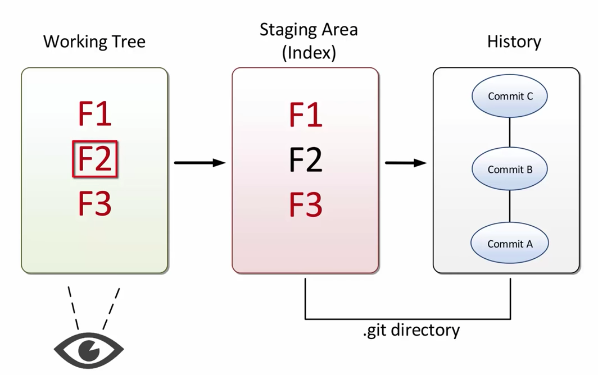{width=500}


Use the Git **commit graph** to represent history. 

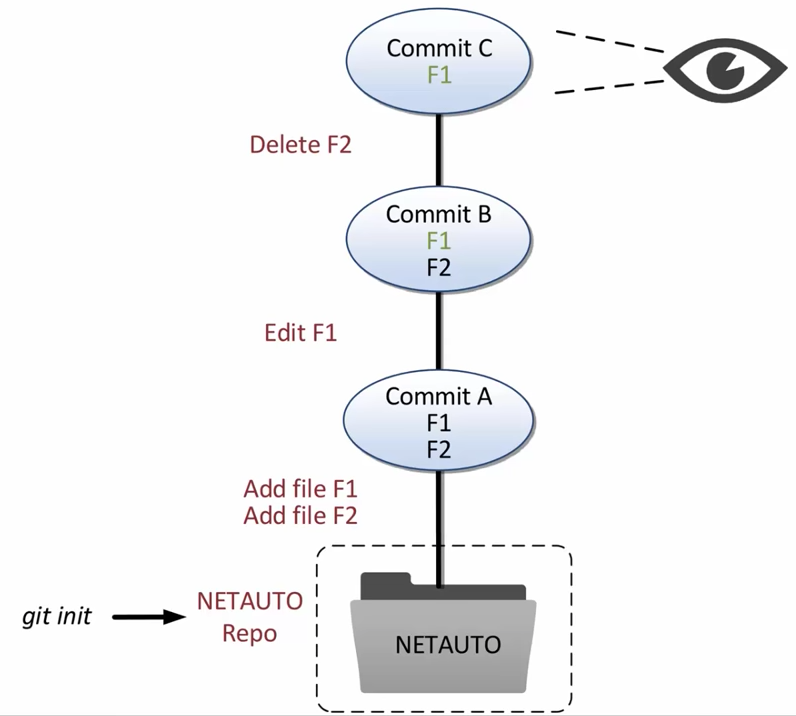{width=500}


#### Git in Shell

Three shell commands, i.e. `pwd`, `cd`, and `ls`, to get you started. 

```
pwd            # check present working directory
cd subfolder   # change directory to a subfolder under current working directory
cd .           # change directory to .     (stays at the current working directory)
cd ..          # change directory to ..    (one folder up current working directory)
cd ../..       # change directory to ../.. (two folders up current working directory)
ls             # list files and folders under currnet working directory; ls is short for list
ls -aF         # list all files and mark folders; -a shows all, -F marks folder with a "/" sign

```


1. **Create a New Git repo**

- Go to an existing folder (named e.g. `somefolder`) on your computer where you will create a new folder as the Git repo. 
- Find out the path leading down to this folder.
    - We will refer to this path as `path_to_somefolder`.
    - For Windows, the path should look like `E:/folder1/folder2/somefolder`
    - For Mac, the path should look like `/Users/username/folder1/folder2/somefolder`.
- Open shell
- Type in the following shell commands line by line. 


```
cd "path_to_somefolder"   # go to the folder where you will create a new folder 
mkdir git_test            # create a new folder called "git_test"; mkdir is short for make directory
cd git_test               # go into the "git_test" folder
ls                        # nothing exists; it's completely empty
ls -aF                    # you see only "./" and "../", which means you can stay or go up one folder

git init                  # make the folder a Git repo; init is for initiate
ls                        # still empty by appearance
ls -aF                    # a hidden folder named ".git" appears 
ls .git                   # a lof of files are stored in ".git"

```

2. **First Git commit**

```
git status                # check current Git status

nano txt                  # create a file called "txt" and add some text in it
                          # "Control + X" to stop editing
                          # "Y" to save changes
                          # "Enter" to quit nano
ls                        # txt appears
cat txt                   # show contents of txt

git status                # txt is shown as an untracked file
git add txt               # add txt from "working area" to "staging area"
git status                # txt is shown as a tracked file, but not committed to any history
git commit -m "add txt file"   # commit it to history and add a message informative of what you did
git status                # no untracked files, no uncommitted file
git log                   # 1st commit is now logged in history

```

3. **Second Git commit**

```
nano dat                  # create a new file and add some numbers as data
nano temp		              # create a new file and add some text
nano txt                  # change or add some text 
ls                        # three files exist

git status                # one file modified; two files untracked
git add txt dat           # add txt and dat from "working area" to "staging area"
git status                # txt and dat are now ready for commit; temp remains untracked
git commit -m "edit txt and add dat"  # commit and add an informative commit message
git status                # temp is still not tracked (it's OK; it's a temporary file)
git log                   # 2nd commit is logged in history

```

4. **Check out a Previous commit**

```
git log                   # record like the one below is called a "SHA ID"
                          # e1328e1c9e66ed759a53a638c9539da35a8246d7
                          # we only need the first several characters to refer to it
git checkout e1328e       # check out the 1st commit; notice how files change in the folder
git checkout master       # come back to the latest commit

```


### Introduction to GitHub

You will use GitHub in one of two ways:

- You have some contents on a local computer and want to upload them to your GitHub account.
- Some contents (maybe yours or not) are on GitHub and you want to download them to a local computer.

It does not matter which is the use case, to make things simpler for starters, we will **always** use a "GitHub first" approach:

- Create or fork a repo on GitHub first.
- Clone the repo down to local computer. 
- If you do have some contents already, put them into the cloned repo. Done!


#### Create a repo on GitHub {#create-repo}

1. Go to your GitHub account at `https://github.com/username`
    - `username` is your GitHub username

1. Click "Repositories" located between "Overview" and "Stars"

1. Click the green "New" button, on the "Create a new repository" page
    - name your new repo under "Repository name" (e.g. `reponame`)
    - choose "Public" 
    - check **"Initialize this repository with a README"**
    - click the green "Create repository" button

1. Check your URL
    - it should look like `https://github.com/username/reponame`
    - `reponame` is the name of the repo you have just created


#### Fork a repo on GitHub {#fork-repo}

If you have discovered a really good GitHub repo that you would like to make a copy of, you can get it in one of three ways: download, clone, fork (and then clone). 

More specifically, you can (a) directly download or (b) directly clone it from someone else's GitHub repo to your local computer, or you can (c) fork it from someone else's GitHub repo into your GitHub repo and then download or clone it from your GitHub repo to your local computer. 

Which method to use depends on how you would like to use the downloaded repo in the future.  

| Action | Is Git repo | To Contribute/Collaborate | Use Case |
|---|:---:|:---:|---|
| download | No | No | you want the latest version only under no version control |
| clone | Yes | No | you want contents with commit history |
| fork |  Yes | Yes | you want repo unde control, and will contribute |

Let's pretend you would like to contribute later and talk about fork. 

Forking someone else's repo is easy. 

1. Go to the GitHub repo you would like to fork at `https://github.com/username/reponame`
    - `username` is someone else's GitHub username
    - `reponame` is the repo you would like to make a copy of

1. Click the `Fork` button on the right corner on top of the page

1. Select an account of yours to host the repo

1. Wait for a few seconds and you are done

1. Check the url and it should look like `https://github.com/your-username/reponame`
    - `your-username` is your GitHub username
    - `reponame` is identical to someone else's `reponame` that you have copied from

Now that this repo is already in your GitHub account, you can either download it or clone it from your account. 


#### Clone a repo to your local computer {#clone-repo}

Regardless of whether you are cloning from your or someone else's GitHub account, you can clone a repo in the following steps. 

1. Decide in which directory you want to store the repo locally
    - create folders if necessary for storing the repo

1. Go to the repo that you would like to make a copy of at `https://github.com/username/reponame`
    - `username` can be either your or someone else's GitHub account
    - `reponame` is the name of the repo you would like to get

1. Click the green "Clone or download" button
    - this is where you can directly **download** the repo if that's what you really want
    - you should see "Clone with HTTPS"
    - if you see "Clone with SSH", click "Use HTTPS" in blue

1. Click the clipboard icon to copy the URL into your clipboard
    - or you can click on the URL and use Control + C to copy it
    - the URL should look like `https://github.com/username/reponame.git`

1. In RStudio, go to "File" > "New Project ..."

1. In the popup window, select "Version Control" > "Git"

1. In the new popup window,
    - in "Repository URL", paste the URL you have copied from Step 4
    - RStudio may automatically fill in "Project directory name", which is the `reponame`
    - if RStudio fails to perform automatic fill-in, simply type in the `reponame` on your own
    - in "Create project as subdirectory of", click "Browse..." and browse to the directory where you have chosen in Step 1
    - check the box for "Open in new session"
    - click "Create Project"

1. You are Done! 
    - check out the folder in the directory of your choice from Step 1


#### Make Changes and Push Changes Back {#push-back}

Assume you have cloned a repo from your GitHub account to your local computer. We will make some changes to downloaded files, add changes to local Git repo, commit changes, and push changes back to GitHub repo. 

`NOTE`: You can only push back commits to your own repo. You cannot directly push commits back to a repo cloned from someone else, unless the other person has added you as a collaborator with write access to the original repo. 


1. In RStudio, under the "Files" tab in the lower right corner
    - click "README.md"
    - in the popup script, write say "add one line from RStudio"
    - save the change
    
2. Click the "Gib" tab in the upper right corner 
    - check the boxes under "Staged" to **add** changes to the **staging area**
    - click "Commit" 

3. In the popup window, 
    - write some message into "Commit message" describing what changes are made
    - click the "Commit" button
    - wait for the popup window to execute **commit**
    - click the "Close" button to close the popup window
    - click the "Push" button in the top right corner to **push** changes back to the GitHub repo

4. Confirm the changes in GitHub repo


References

- [Git and GitHub << R Packages << Hadley Wickham](http://r-pkgs.had.co.nz/git.html)
- [Using Git within RStudio](https://cfss.uchicago.edu/git05.html) 
- [Setup Git and GitHub](https://cfss.uchicago.edu/git04.html): See how to clone a repo, make changes, add and commit changes, and push commits using Bash shell. 


#### Cache Credentials {#cred}

When pushing to GitHub using HTTPS, if you are constantly being queried for username and password, you can choose to (a) cache your credentials (username, password), or (b) set up SSH keys. 

Since GitHub is recommending using HTTPS, we will introduce how to cache credentials. Setting up SSH keys is more secure way of connecting to GitHub, but it requires some work and you will have to pull/push to GitHub using SSH instead HTTPS later. 

- **Windows users**: In shell, enter `git config --global credential.helper wincred` 
- **Mac users**: In shell, enter `git config --global credential.helper osxkeychain`

After you setup your credential helper, next time you push, you will be asked to enter your username and password one last time.  


#### Contribution and/or Collaboration

1. [Fork a repo](#fork-repo) from someone else to your GitHub account
2. [Clone the forked repo](#clone-repo) from your GitHub account to your local computer

Only need to do Steps 1-2 once. 

3. [Make changes and push them back](#push-back) to your GitHub account
4. Make a pull request
5. Resolve conflicts if necessary
6. [Update from the original repo] hosted on someone else's GitHub account

Repeat from Steps 3-6 over and over and over again. 


#### Make a Pull Request


#### Resolve Conflicts


#### Update from Original repo


## Introduction to ggplot2


## Introduction to Shiny


