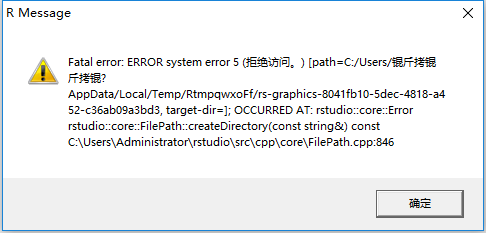

--- 
title: "Quantitative Research Methods for Education"
author: "Wenliang He"
date: "`r paste('Updated on', as.character(Sys.Date()))`"
site: bookdown::bookdown_site
output: bookdown::gitbook
documentclass: book
biblio-style: apalike
link-citations: yes
description: "This is the 1st Edition"
---

# Introduction

Before diving into Statistics, you need to install some software, notably R and RStudio, and register for some accounts. 

## Software Installation {#install}

- section title is [Indexing Lists] 
- [section on indexing lists][Indexing Lists]
- [section on indexing lists](#index-lst)
- section number is \@ref(index-lst)

### Install R

[R](https://www.r-project.org/) is a free software environment for statistical computing and graphics. 

[CRAN](https://cran.r-project.org/), **C**omprehensive **R** **A**rchive **N**etwork, is a network of web servers around the world that store identical, up-to-date versions of various code for R. 

1. Choose a [CRAN mirror](https://cran.r-project.org/mirrors.html) that is close to you. 
    - scroll down the list to your country (e.g. China) 
    - choose a link hosted by an institution that is close to you
    - `Warning`: If you are not using a mirror, but visiting the official link (https://cran.r-project.org/) to download R. The downloading speed can be painfully slow. If so, consider using a mirror.  

2. Choose the link corresponding to your operating system.  


3. Mac Users
    - scroll down to the `Lastest release` section
    - click to download the lastest version that looks similar to `R-3.5.1.pkg`


4. Windows Users
    - click on the link `install R for the first time`
    - download the lastest version of R that looks similar to `R-3.5.1` as shown below
    - `Note`: The R version shown below does not distinguish between 32-bit and 64-bit Windows, since two versions are combined into one file to simplify the download. But you would still need to choose one during the installation process (see details below).
  


5. Install R
    - `Warning`: We highly recommend you to **use English as the default language** for your R. You will search for help on the internet at some point. It is simply easier to communicate when help seekers and help givers are speaking the same language. 
    - `Warning`: We highly recommend you to **use the default directory (默认路径)** for installation. Third-party packages will look for R. We do not want to make it too hard for them. 
    - For Mac users, the installation process should be straightforward. 
    - For Windows users, you need to find out whether your Windows is a 32-bit or 64-bit system and install the one identical to your system. To find out which version is your Windows, right-click on `我的电脑` -> `属性` -> `系统类型`. This is where you can find the information. 


### Install RStudio

[RStudio](https://www.rstudio.com/) is an IDE (**I**ntegrated **D**evelopment **E**nvironment), a powerful user interface development specifically for R. For individual use, use can download the free open source edition of RStudio. 

`Note`: You can choose to install a [Preview release of RStudio](https://www.rstudio.com/products/rstudio/download/preview/). The preview release has more features than standard release. However, the downloading speed can be painfully slow. In the following, we will demonstrate installation of the standard release. 

1. Go to the [official website for download](https://www.rstudio.com/products/rstudio/download/) and click on the **DOWNLOAD** button for **RStudio Desktop** under the Open Source License, which is completely free. 


2. Choose the link corresponding to your operating system.  


3. Install RStudio

Run the downloaded program and use the **default directory** for installation. The rest of the installation process should be straightfoward.

4. Open RStudio

The first time you open Rstudio, you might encounter the following error message, which suggests that you are not authorized to run the program. 

To address it, right-click on `rstudio.exe` -> `属性` -> `兼容性` -> `以管理员身份运行`. 



5. Change Settings

By default, RStudio is using a CRAN mirror hosted in the US. If you are outside the US (e.g. in China), you may have trouble fetching data/code into R. The solution is to use a local CRAN mirror.  

- after openning RStudio, find `Tools` -> `Global Options` -> `Packages`
- under `CRAN mirror`, click `Change...`
- scroll down the list and select the one mirror that is close to you
- click `OK` to commit the change


Now that you have installed R and RStudio, some additional resources are available. 

- [Take a quick look at R and RStudio](http://stat545.com/block002_hello-r-workspace-wd-project.html): You can checkout other links later. Highly recommend to take a look at this link to familiar yourself with R and RStudio. `TODO`: make a video on this
- [Customizing RStudio](https://support.rstudio.com/hc/en-us/articles/200549016-Customizing-RStudio): It contains more information about changing the default settings of RStudio. You may want to check out the sections on **Source Code** or choose a different Editor theme under **Appearance** to make your RStudio looks different/cooler. 
- [Keyboard Shortcuts](https://support.rstudio.com/hc/en-us/articles/200711853-Keyboard-Shortcuts): Shortcuts are always helpful. This help page actually sits on your own computer already. In RStudio menu, `Tools => Keyboard Shortcuts Help`, which will gives you identical contents.
- [RStudio IDE Documentation](https://support.rstudio.com/hc/en-us/sections/200107586-Using-the-RStudio-IDE): The two external links above are coming from this documentation, which contains much more information regarding varied topics of using RStudio IDE. 
- [RStudio Documentation](https://support.rstudio.com/hc/en-us/categories/200035113-Documentation): Official documentation on varied RStudio^TM^ products, including RStudio IDE and more. 


### Install R Packages

R is an extensible system and many people share useful code they have developed as a package via CRAN and/or GitHub. 

#### Install from CRAN

This is the most commonly used method to install R packages directly from CRAN. In the following, we will install the `ggplot2` package and use it as a running example. 

In the R console, you type 

```
install.packages("ggplot2")
```

Note, the input must be a **string** as enclosed by double quotes `""`. 

This is usually good enough. But to be extra-careful, the `dependencies=TRUE` argument is often added to explicitly tell R to install any additional packages that `ggplot2` requires to run its functions. 

```
install.packages("ggplot2", dependencies = TRUE)
```

By default, `dependencies = NA` means `c("Depends", "Imports", "LinkingTo")`. Setting `dependencies = TRUE` adds `"Suggests"` to the previous list, which tells R to install all the packages needed to run a package, their examples, tests and vignettes.

For more on managing R packages, please refer to the [R Installation and Administration Manual](https://cran.r-project.org/doc/manuals/R-admin.html#Add_002don-packages).

To install multiple packages, e.g., `pck1` and `pck2`, use 

```
install.packages(c("pkg1", "pkg2"), dependencies = TRUE)
```


> **Practice**: Install the following packages that will be required later in the course.   
>
- [ggplot2](https://ggplot2.tidyverse.org/): A good alternative to R's base graphing packages. 
- [plotly](https://plot.ly/r/): A tool that enhances ggplot2 by translating static plots into interactive graphs
- [dygraphs](http://rstudio.github.io/dygraphs/): A graphing tool specifically designed for charting time-series data in R
- [DiagrammeR](http://rich-iannone.github.io/DiagrammeR/docs.html): A tool for creating diagrams and flowcharts using Graphviz and Mermaid
- [rmarkdown](https://rmarkdown.rstudio.com/): 
- [bookdown](https://bookdown.org/yihui/bookdown/): A tool for combining multiple R markdown files into a book
- [shiny](http://shiny.rstudio.com/): An R package to build interactive web apps
- [shinythemes](https://rstudio.github.io/shinythemes/): More themes for shiny apps
- [DT](https://rstudio.github.io/DT/): A tool to create dynamic tables
- [dplyr](https://dplyr.tidyverse.org/): A package to perform data manipulation
>

<br>
The function defined below would (a) check if required packages exist, (b) install, if not already installed, and (c) load the packages.

```{r, eval=FALSE}
force_load <- function(pkgs, use_require=FALSE) {
  # https://gist.github.com/smithdanielle/9913897
  # https://cran.r-project.org/web/packages/install.load/README.html
  new_pkgs <- pkgs[!(pkgs %in% installed.packages()[, "Package"])]
  if (length(new_pkgs)) 
    install.packages(new_pkgs, dependencies = TRUE)
  if (use_require) {
    loaded = sapply(pkgs, require, character.only = TRUE)
  } else {
    loaded = sapply(pkgs, library, character.only = TRUE)
  }
  return(loaded)
}

packages = c("ggplot2", "ggthemes", "rmarkdown", "bookdown", "shiny", "Hmisc")
loaded = force_load(packages)
loaded
```

#### Install from Source Code
Occasionally, you might encounter an error message telling you that the package to be installed requires an R version greater than the one you currently have. You can, of course, choose to re-install R, which might necessitate re-installing all the other packages that are previously installed. What a hassle! Alternatively, you can choose to download the source code for the package and install from the source code directly.

1. In any search engine (e.g. www.baidu.com), search for `CRAN package ggplot2`. This should lead you to the `ggplot2` package hosted on CRAN.


2. Scroll down to the **Downloads** section, next to **Package source**, click on the link to the file that ends with `tar.gz`. Save it under a local directory where you can easily find it.


3. In R console, type the following

```
install.packages("download_path/ggplot2_3.0.0.tar.gz", repos = NULL, type = "source")
```

where `download_path` is the directory that stores the downloaded source file. 


#### Commonly Encountered Problems

While installing packages, one type of error messages has the following pattern. 

```
Warning in install.packages :
  error message
```

The specific `error message` you might encounter can be very different from time to time. Some examples are as follows. 
```
Warning in install.packages :
  InternetOpenUrl failed: ''

Warning in install.packages :
  package ‘packagename’ is not available (for R version 3.5.0)

Warning in install.packages :
  unable to access index for repository https://cran.rstudio.com/src/contrib:
  cannot open URL 'https://cran.rstudio.com/src/contrib/PACKAGES'
Installing package into ‘C:/Users/YourUserName/Documents/R/win-library/3.5’
(as ‘lib’ is unspecified)

Warning in install.packages :
  unable to access index for repository https://cran.rstudio.com/src/contrib:
  cannot open URL 'https://cran.rstudio.com/src/contrib/PACKAGES'
```

In your R console, type `getOption("repos")`. If you get the following response, it means that you fail to set a local CRAN mirror. See the **Change Settings** section under **Install RStudio** for the solution. 

```
CRAN 
"https://cran.rstudio.com/" 
attr(,"RStudio")
[1] TRUE
```

### Update R and R Packages

- Update R

The [CRAN solution](https://cran.r-project.org/bin/windows/base/rw-FAQ.html#What_0027s-the-best-way-to-upgrade_003f) is not particularly good. 

- Update R Packages

```
update.packages(ask = FALSE, checkBuilt = TRUE)
```

`Note`: This will only update packages directly installed from CRAN. So if you use a package that lives only on GitHub, you will need to update it manually, e.g. via  `devtools::install_github()`.

### Register a GitHub account

1. Choose a GitHub Username

Choosing a proper GitHub username is **extremely important**. Given the _Username_ you choose, your GitHub account will look like `https://github.com/Username`. This "website" will be the one place to host and showcase all of your coursework. In the information age, when online presence is more important than ever, this is your online portfolio, your "voice", your professional "business card".

```{r, eval=F, echo=F}
Therefore a few tips:

- **Incorporate your actual name**. Using your actual name makes it easier for people to remember. Moreover, people like to know who they are dealing with.
- **Use proper case styles**. You can use **camel case**, e.g. WeChat, FedEx, iPhone, eBay, **snake case**, e.g. wenliang_he, or **kebab case**, e.g. Wenliang-He to introduce complexity into your usernames to avoid conflicts. Please refer to [Special Case Styles](https://en.wikipedia.org/wiki/Letter_case#Special_case_styles) for more informatin. 
- **Use topic words**. If you are creating a themed account posting things for a specific purpose. You can consider using words evocative of a topic, e.g. Wen4Education, GeoStatsNinja.
- **Make it timeless**. Try to avoid using your current school name, employer, or place of residence etc. As things change, your username might become irrelevant.
- **Pick a username you feel comfortable revealing to your future boss**. People are fond of coming up with unique, bold and sassy usernames. But be careful not to go too far.
- **Shorter is better than longer**. This should be obvious.
- **Remove numbers whenever possible**. Try your best to avoid appending random numbers to your username.


`Note`: The tips presented above are adapted from suggestions given by [Jenny Bryan](http://happygitwithr.com/github-acct.html).
```

You can change your username later, but it's better to get it right the first time. 

- https://help.github.com/articles/changing-your-github-username/
- https://help.github.com/articles/what-happens-when-i-change-my-username/

2. Register a GitHub Account

Go to [GitHub](https://github.com) and register for a free account. By default, a free GitHub account offers only public repositories that are visible and accessible to the general public. To have private repositories, you needs to upgrade to a paid account. 

Here is the good news: For students, faculty, and research staff with `.edu` email accounts, you can upgrade to a [GitHub Education](https://education.github.com/) account that offers free unlimited private repositories. Rejoice and enjoy!


### Install Git


## Introduction to R


### Essential Basics {#r-basics}

In R, every method is a function: `name` + `()`. For example, in your R console, try type `help()`. 

### Atomic Data Types {#atomic-dtype}

There are four commonly used atomic data types. 

- logical: e.g. TRUE, FALSE
- integer: e.g. -2, 0, 1, 2
- numeric: e.g., -2.0, 0.05, 1.2
- character: e.g., "-2.0", "cat", "dog"

#### Logical {#logical}

Logical is simply `TRUE` or `FALSE`. To note, `T` is a shorthand for `TRUE`. They are strictly identical. 

```{r}
TRUE
T
```

To check the data type of `TRUE`, use the `class()` function.
```{r}
class(TRUE)
class(T)
```

To note, you **MUST NOT** use `True` or `False`, which would result in an error. 
```{r, error=TRUE}
True
```


#### Integer {#integer}

If you directly type `2` into the R console, you might think it's an integer, but it is in fact of numeric data type. To note, numeric data type is also called **floating point** in other programming languages. 

```{r}
2; class(2)
```

The `;` sign is used to separate commands such that two lines can be written succinctly in one line. In our case, ```2; class(2)``` is identical to 

```{r, eval=FALSE}
2
class(2)
```

To have an integer, you can attach an `L` to the integer. 
```{r}
2L; class(2L)
```

#### Numeric {#numeric}
Numeric is synonymous to floating point.

```{r}
2.0; class(2.0)
```

#### Character {#character}
Character is synonymous to string.

```{r}
"hi there"; class("hi there")
```

To note: Any things if it has double quotes, it must be characters.
e.g.
```{r}
class("2.0")
```

Data type precedence: logical < integer< numeric < character
And they can be converted to each other.
We can see these examples:

```{r}
as.integer(2) 			                # as.integer() converts values to integer
class(as.integer(2)) 				        # integer
as.integer(TRUE) 					          # convert logical to integer
as.numeric(TRUE) 					          # convert logical to numeric
as.logical(100)                   	# convert numeric to logical
                                    # TRUE is for 1; FALSE is for 0.
as.character(1.2) 					        # convert numeric to character
```

**Conclusion**: as.+ data type () means what we want convert to.

### R Object Types {#object-types}

There are four basic object types in R.

#### Vector {#vector}

Vector is the workhorse of R computing. Elements of a vector MUST be of the same dtype.

```{r}
var1 = c(1, 2, 3, 4)              # var1 is a vector, it includes numbers 1,2,3,4
                                  # c() is a function, where c stands for concatenate
var2 = 1:4	                      # practically identical
```

```{r}
var3 = c('a','b','c','d')				    # create a third vector of a different dtype
var3 = letters[1:4] 					      # identical
```

To check the data type of vector's elements, use `class()` too.

```{r}
class(var1); class(var2)				    
```

A vector has a length, can use `length()` to get.
```{r}
length(var1); length(var1)	
```

Remember: logical < numeric < character
```{r}
c(TRUE, 2) 							           
c(TRUE, 2, 3.0) 						        
c(TRUE, 2, 3.1) 						        
c(TRUE, 2, 3.1, 'four') 				   
```

Concatenating vectors gives a vector.

Remember to follow the same dtype precedence rule
```{r}
c(var1, var2) 						          
c(var1, var3) 						          
```

Vectors can ????????????

```{r}
var1 + var2							            # vectorized operation operates on each element
var1 == 3							              # '==' means 'compare' and '=' means 'assign'
```

**Broadcasting**: When operate with vectors of different lengths,the shorter vector is recycled to the full length, this is called broadcasting.

```{r}
var1 + c(1, 2)						         
var1 + 2								           
```

To note: vectors interact with one element only works if one is multiple times longer than the other.

```{r}
var1 + 1:3 					              
```

#### Matrix {#matrix}
Matrix is xxx

A matrix should have only one data type.

We can bind vectors of same length and **same** data type gives a matrix.

```{r}
mat1 = cbind(var1, var2);mat1
```

We can see the data type and dimension of the matrix, the dtype will change to the upper dtype.
```{r}
class(mat1)							          
dim(mat1)							              # 4 rows, 2 column
```

If we bind vectors of same length, different dtype.
```{r}
mat2 = cbind(var1, var3);mat2       # numeric changed to character
```

#### Dataframe {#dataframe}

Binding vectors of same length, **different** dtypes gives a dataframe.

Use `data.frame()` function.
```{r}
dat = data.frame(var1, var3);dat
```

Check the class and the dimension of the data.frame.

Hint: a dataframe is essentially a dataset.
```{r}
class(dat)							            
dim(dat)								    
```

#### List {#list}

Binding any objects gives a list.
```{r}
lst = list(var1, var3, mat1, dat);lst
class(lst); length(lst) 				                    # a list class with 4 elements
```

### Indexing {#indexing}

In R, `any_name[]` implies `any_name` is an object, and `[]` implies calling out values from objects.

#### Indexing Vectors {#index-vec}

 - Indexing by position
```{r}
var3[1]								              # single selection; select the first element
var3[length(var1)] 					        # single selection; select the last element
var3[c(1,1,3,4)]						        # multiple selection
var3[2:4] 							            # slicing
var3[-1]								            # reverse single selection; select all but the first
var3[-length(var1)]					        # reverse single selection; select all but the first
var3[c(1,1,3,4)]						        # reverse multiple selection; all but the specified
var3[-c(2:4)]							          # reverse slicing; MUST NOT var[-2:4]
```

 - Indexing by name
```{r}
names(var1) = letters[1:4]; var1			    # give names to each element of a vector
var1 = c(a=1, b=2, c=3, d=4); var1        # identical
var1[1]; var1["a"]                        # call out the first element
var1[c('a', 'a', 'c', 'd')]			          # identical to var1[c(1,1,3,4)] with more typing
var1[[1]]; var1[["a"]]                    # notice the difference with var1[1] or var1["a"]
unname(var1[[1]]); unname(var1[["a"]])    # identical
```

 - Indexing by a logical vector
```{r}
idx = var1 <= 2; idx 						    # create an index vector of the logical dtype
var1[idx] 						 	            # call out values according to the index vector
var3[idx] 							            # call out values according to the index vector
```

#### Indexing Matrices/Dataframes {#index-matdat}

 - Indexing by position
 
`matrix/dataframe[row_indices, column_indices]`
```{r}
dat[1:3, 1]							            
dat[c(1,3), ]							          # select the 1st and 3rd rows only
dat[, c(1,1,2)]						          # select 1st column twice, 2nd once
```

 - Indexing by name
```{r}
colnames(dat) = c("id", "group")		# give column names to our dataframe
rownames(dat) = letters[1:4]			  # give row names to our dataframe
dat[c('a', 'b', 'c'), "id"]					# identical to dat[1:3, 1]
dat[c('a', 'c'), ]						      # identical to dat[c(1,3), ]
dat[,c("id","id","group")]				  # identical to dat[, c(1,1,2)]
```

 - Index rows by position, columns by name
```{r}
dat[1:3, "id"] 						          
dat[,1]; dat[,"id"]						      # return a vector that is the 'id' column
dat$id 								              # identical; '$' sign is a shorthand
dat$i; dat$g                        # "$" sign does partial matching
dat[[1]]; dat[["id"]]               # identical
dat[1]; dat["id"] 						      # return a data.frame with 'id' as the only column
dat[,1,drop=F]; dat[,"id",drop=F]   # identical
```

#### Indexing Lists {#index-lst}

- section title is [Software Installation] 
- [section on software installation][Software Installation]
- [section on software installation](#install)
- section number is \@ref(install)

 - Indexing by position
```{r}
lst[1]							                # return a list with the first object
lst[1:2] 							              # return a list with the first two objects
lst[[1]] 							              # return var1
lst[[1]][1]						              # select 1st element in the 1st object
lst[[c(1,1)]]                       # identical
lst[[2]][3]						              # select 3rd element in the 2nd ojbect
lst[[c(2,3)]]                       # identical
```

 - Indexing by name
```{r}
names(lst) 							            # NULL indicates no names
names(lst) = c("var1","var3","mat1","dat") 	# give names to the list
lst[["var3"]] 						          # calling out contents of the cell called "var3"
lst$var3 							              # identical; '$' sign is a shorthand
```

 - Indexing by a logical vector
```{r}
lst[c(T, T, F, F)] 						      # same idea applied to calling contents from lists
```

### Factors {#factor}

Factor is special data type.

Continuous/ordinal variables as numeric vectors;categorical variables as character vectors

[Tutorial on factors]( http://www.ats.ucla.edu/stat/r/modules/factor_variables.htm)

```{r}
# fac = dat[,"var3"]; fac					      # storing character vectors in dataframes
                                      # gives us factor variables/vectors (a.k.a. factors)
fac = factor(var3); fac					      # identical; convert character vectors into factors
class(fac)							              # 'factor'
levels(fac)							              # levels of a factor variable is its categories
fac[1]
fac[1, drop=TRUE]
```


## Introduction to R Markdown

```{r, echo=FALSE}
library(emo)
library(DiagrammeR)

mermaid("
graph LR
MU(Markup) --> MD(Markdown) 
MD --> PDMD(Pandoc Markdown)
MD --> GHMD(GitHub Markdown)
MD --> PHPMD(PHP Markdown)
PDMD --> RMD(R Markdown)
RMD --> BD(Bookdown)
", height=200)
```

There are some resources for learning Markdown, GitHub Markdown, and R Markdown. 

**Markdown Tutorials**

- [eherrera.net](http://eherrera.net/markdowntutorial/): a fast way to learn Markdown basics plus an interactive tutorial
- [markdown guide - basics](https://www.markdownguide.org/basic-syntax): a more detailed Markdown tutorial juxtaposing _code_ and _effect_
- [markdown guide - extended](https://www.markdownguide.org/extended-syntax): more contents in addition to the basics
- [gitlab.com](https://about.gitlab.com/handbook/product/technical-writing/markdown-guide/): a much more detailed tutorial on Markdown

**R Markdown Tutorials**

- [Jacolien's blog](http://www.jacolienvanrij.com/Tutorials/tutorialMarkdown.html): a simple R Markdown tutorial
- [rstudio.com - basics](https://rmarkdown.rstudio.com/articles_intro.html): a quick intro to R Markdown, similar in difficulty to Jacolien's tutorial
- [rstudio.com - detailed](https://rmarkdown.rstudio.com/lesson-1.html): the official R Markdown tutorial with more details
- [emoji cheatsheet](https://www.webpagefx.com/tools/emoji-cheat-sheet/): a great resource for looking up **emoji** `r emo::ji("smile")`, which can be used in GitHub Markdown and R Markdown


## Introduction to Git & GitHub

## Introduction to ggplot2

## Introduction to Shiny


