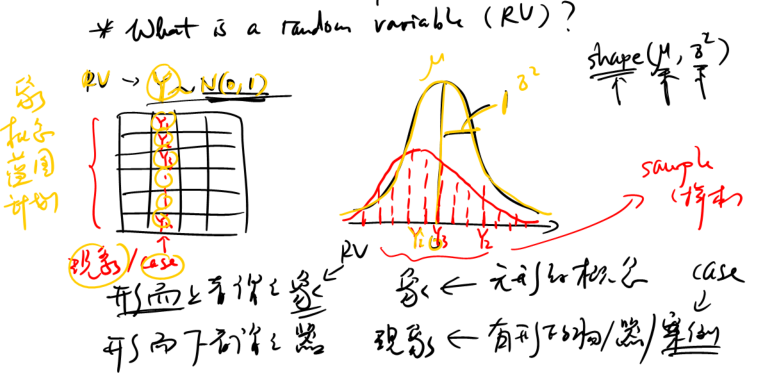
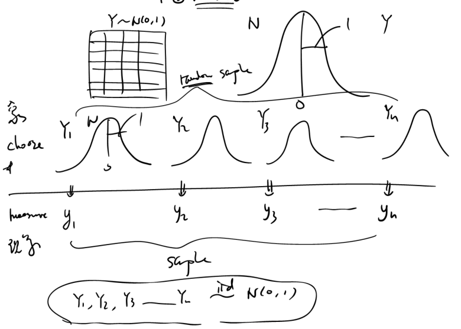
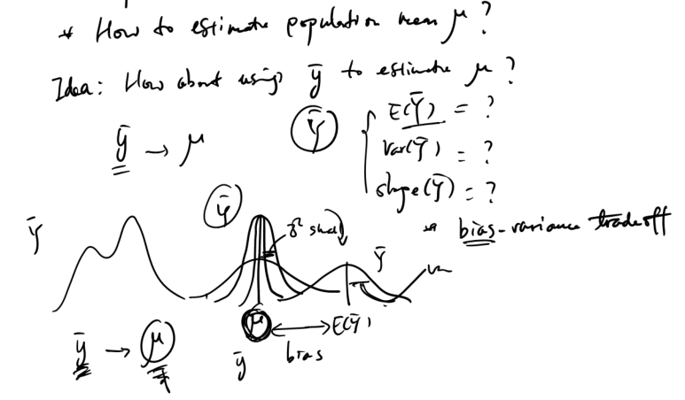

# Statistical Inference
```{r, include=FALSE}
library(DiagrammeR)

# define a function to draw a polygon for density curves
colorArea <- function(from, to, func, col="red", ...){
  xs <- seq(from, to, length.out=100)
  ys <- func(xs)
  polygon(c(from, xs, to), c(0, ys, 0), col=col, ...)
}
```

## Random Variable

|| Var1 | Var2 | Var3 | Var4 | 
|---|---|:---:|---|---|
|1| | $y_1$ | | | 
|2| | $y_2$ | | | 
|3| | $y_3$ | | | 
|4| | $...$ | | | 
|5| | $y_n$ | | | 

What is a **_random variable_** or **_RV_**? We have rows as cases and columns as variales. How is a _variable_ as we know it connected with the idea of a _random varible_?


> 形而上者谓之道 - 在天成象 - 象（无形之概念、蓝图、计划）

> 形而下者谓之器 - 在地成形 - 现象（有形之物、器、案例）





Let's choose $Y_1, Y_2, Y_3, ..., Y_n$ from the standard normal distribution $N(0,1)$. 

- before we see the value of $Y_i$
    - $Y_i$ is a **random variable**, which is practically a probability distribution
    - $Y_1, Y_2, Y_3, ..., Y_n$ is a **random sample**
    - a statistic (e.g., $\bar{Y} = 1/n \sum Y_i$) computed from a random sample is another _random variable_ called a **sampling statistic**
- after we see the value of $Y_i$
    - $y_i$ is a **case**, which is a specific number
    - $y_1, y_2, y_3, ..., y_n$ is a **sample**
    - a statistic (e.g., $m=1/n \sum y_i$) computed from a sample is a _number_ called a **sample statistic**

In this context, the word **random** means **unsettled**. The value of a _random_ variable will not be _settled_ unless it is actually sampled and observed, i.e., an actual data point is collected.  

### IID - Independently and Identically Distributed

The phrase, let's choose $Y_1, Y_2, Y_3, ..., Y_n$ from the standard normal distribution $N(0,1)$, can be succinctly summarized as follows:

$$Y_1, Y_2, Y_3, ..., Y_n \overset{iid}{\sim} N(0,1) $$
where **iid** means **i**ndependently and **i**dentically **d**istributed.

#### Identically Distributed
```{r, echo=FALSE}
mermaid("
graph LR

A((B)) --- B((B)) 
B --- C((B)) 
C --- D((R)) 
D --- E((R))

linkStyle default stroke-width:0px
class A,B,C blacks
class D,E reds
classDef blacks fill:darkgray
classDef reds fill:red

", height=100)
```

Let's image that we have 3 black (B) balls and 2 red (R) balls. 

> If you would randomly choose a ball, what is the probability that it's black? 

**Answer**: $P(B_1) = 3/5$. 

> Now if we indeed pick a black ball in our first try and we decide to choose a second ball. Given that we do not put the first ball back, what is the probability that the second one is also black?

**Answer**: $P(B_2) = 2/4$. 

Hence, choosing two balls in this example violates the **identically distributed** assumption. 

Two important ideas emerge in the _process of choosing_ (aka _sampling_) things. 

- In the previous sampling process, after each draw, if we do not put the balls back, this way of choosing things is called **_sampling without replacement_**. 
- In contrast, if you do put the balls back after each draw, it is called **_sampling with replacement_**. 

It is hence clear that the word _replacement_ in this context practically means _putting things back_ (or more precisely _finding a replacement_ for the one that is drawn). 

In practice, we would rarely sample with relacement. However, if the pool is large enough, we can ignore the slight change in probability after each time one case is drawn. 

#### Independently Distributed

Now let's consider another case. Imagine that at the beginning of a semester, you as a student is trying to find a course to enroll. There are **N** courses in total and all courses are equally attractive (i.e., same probabiliy of being chosen by a student). You and your friend from the same dorm are discussing about the teachers and courses. Eventually, the two of you decide to enroll into the same course denoted as **C**. 

> What are the probabilities of you and your friend enrolling into course **C**?

**Answer**: $P(C_1) = 1/N$ and $P(C_2) = 1/N$. Since there are **N** courses in total and all are equally attractive, the probabilities of you and your friend enrolling into course **C** are the same. 

> Is the probability of you enrolling into the course independent of the probability of your friend enrolling into the same course?

**Answer**: obviously no! Because you and your friend are not making the course enrollment decisions separately, but with much discussion going around. 

Hence, choosing the same course in this example violates the **independently distributed** assumption, even though they are _identically distributed_. 


### Random Variable vs. Case

|| Random Variable(s) | Case(s) |
|---|---|---|
| is a | concept | instance |
| is a | probabiilty distribution | number |
| comprise a | population | sample |
| with sample size | $n = \infty$ or all data | $n$ is finite or some data |
| comprise a | probability distribution | empirical spread/distribution |
| comprise a | random sample | sample |
| give rise to a | sampling statistic | sample statistic |

### Properties of a Random Variable

Previously, we have $Y_1, Y_2, Y_3, ..., Y_n \overset{iid}{\sim} N(0,1)$ and $\bar{Y} = \frac{1}{n} \sum_{i=1}^{n} Y_i$, where both $Y_i$s and $\bar{Y}$ are random variables. In practice, we would encounter a variety of random variables. As a result, we would constantly ask the questions:

- What does a RV look like?
- What is the distribution of a RV?
- What are the properties of a RV?
    - center of a RV or $E(RV)$
    - spread of a RV or $Var(RV)$
    - shape of a RV or $shape(RV)$

The first two questions are identical. The first one is using informal language and the second using formal academic language. The two questions are reduced to the third question, which is basically asking for a quick summary of a distribution in terms of the _center_, _spread_, and _shape_. 

The properties of a RV can be succintly summarized as 

$$Y \sim \forall(\mu, \sigma^2) $$
where $\forall$ stands for **_any_**. Notice $\forall$ is just an inverted **A**. 


## Central Limit Theorem 

**Central Limit Theorem** or **CLT** is the singularly most important theorem in statistics. CLT forms the foundation of **statistical inference**, a subject of perpetual interest in statistics. 

### Presenting Central Limit Theorem

1. Given a random variable Y of **any shape** with mean $\mu$ and variance $\sigma^2$,

$$Y \sim \forall(\mu,\sigma^2)$$

2. We choose a random sample from Y
$$Y_1, Y_2, Y_3, ..., Y_n ~ \overset{iid}{\sim} ~ \forall(\mu,\sigma^2)$$
where each $Y_i$ is a random variable with $E(Y_i) = \mu$ and $Var(Y_i) = \sigma^2$. 

3. We can compute the sampling statistic of the sample mean
$$\bar{Y} = \frac{1}{n} \sum_{i=1}^{n} Y_i$$
where $\bar{Y}$ becomes another random variable. 

4. Hence, we would immediately ask the question: What are the properties of $\bar{Y}$?

The answer to this question gives birth to the singularly most important theorem in statistics, known as the **_Central Limit Theorem_** or **CLT**. See the proof of part of the theorem below.

**Answers**:
$$\bar{Y} \sim N \left( \mu, \frac{\sigma^2}{n} \right)$$
or equivalently

- $E(\bar{Y}) = \mu$
- $Var(\bar{Y}) = \sigma^2 / n$
- $shape(\bar{Y}) = N$

The most surprising part of the CLT is the discovery that given a random variable $Y$ of **any** distribution, $\bar{Y}$ is **always** normally distributed as long as two conditions are satisfied:

1. $Y_1, Y_2, Y_3, ..., Y_n ~ \overset{iid}{\sim} ~ \forall(\mu,\sigma^2)$
2. sample size n is large enough


`Proof - Prerequisites`:

- $E(cX) = c E(X)$
- $E(X+Y) = E(X) + E(Y)$
- $E(cX) = c^2E(X)$
- $Var(X+Y) = Var(X) + Var(Y)$ if $X \perp Y$, i.e., X is independent of Y

`Proof`:
$$E(\bar{Y}) = E( \frac{1}{n} \sum_{i=1}^{n} Y_i ) = \frac{1}{n} E( \sum_{i=1}^{n} Y_i ) 
= \frac{1}{n} \sum_{i=1}^{n} E(Y_i) =  \frac{1}{n} \sum_{i=1}^{n} \mu 
= \frac{1}{n} n\mu = \mu$$

and

$$Var(\bar{Y}) = Var( \frac{1}{n} \sum_{i=1}^{n} Y_i ) 
= \frac{1}{n^2} Var( \sum_{i=1}^{n} Y_i ) 
= \frac{1}{n^2} \sum_{i=1}^{n} Var(Y_i) =  \frac{1}{n^2} \sum_{i=1}^{n} \sigma^2 
= \frac{1}{n^2} n\sigma^2 = \frac{\sigma^2}{n}$$

Note that the proof of $E(\bar{Y}) = \mu$ and $Var(\bar{Y}) = \sigma^2 / n$ are very straitforward. However, showing that the $shape(\bar{Y}) = N$ is much more difficult and is beyond the scope of this book. The third point is in fact the most important contribution of the Central Limit Theorem.


### Understanding Central Limit Theorem

```{r, echo=FALSE}
mermaid("
graph LR

A(Random Variable) -->|Sampling|B(Sample)
B -->|Inference|A
B --> C(Case1)
B --> D(Case2)
B --> E(Case3)
B --> F(Case4)

", height=250)
```

#### Sampling Process

Given a random variable, the sampling process is the process of getting a sample of cases. Get a case involves two steps: (1) choose and (2) measure. 




To sum up, 

1. Y is a RV  `<=>`  $\bar{Y} \sim N(\mu, \sigma^2)$ 
2. choose a random sample from Y `<=>` $Y_1, Y_2, Y_3, ..., Y_n ~ \overset{iid}{\sim} ~ \forall(\mu,\sigma^2)$
3. choose a sample from Y `<=>` $y_1, y_2, y_3, ..., y_n$

#### Inference 
Given a sample of cases, inference is the process of estimating properties of the original random variable. The first and foremost question to ask is 

> How to estimate the population mean $\mu$?

An intuitive reaction is to consider using sample mean $\bar{y}$ to estimate population mean $\mu$. Since each time we collect a sample, the sample mean will change. It is thus natural to consider the sampling distribution of sample mean and the answer is readily given by the CLT. 

$$\bar{Y} \sim N \left( \mu, \frac{\sigma^2}{n} \right)$$

 

#### Further Notes

Another way to present CLT is

$$\sum Y_i = n\bar{Y} \sim N( n\mu, n \sigma^2 )$$
which suggests that **any random disturbances added together** would give rise to **a normal distribution**. 


Given the CLT

$$\bar{Y} \sim N \left( \mu, \frac{\sigma^2}{n} \right)$$

we know that $\bar{Y}$ is called the **sample mean**; $N$ is a probability distribution; $\mu$ is a mean; $\sigma^2/n$ is a variance; and $\sqrt{\sigma^2/n}$ is the standard deviation. 

Since the sampling process and inference are so important, we would invent some new terms.

- $\bar{Y}$ is the _sample mean_ that is generally known as a **sample statistic**
- $N$ is called a **sampling distribution**, or in this context, the sampling distribution of the sample mean
- $\sqrt{\sigma^2/n}$ is called the **standard error** that is the standard deviation of the sampling distribution of the sample mean
- `Definition`: **_sampling distribution_** is the _probability distribution_ of a sample statistic
- `Definition`: **_standard error_** that is the _standard deviation_ of a sample statistic


## Statistical Inference

Statistical inference is a formal mathematical technique used to **infer whether a hypothesis is true based on existing evidence**, i.e., data that we have collected. 

### The Diamond Expert

Imagine that you are an expert on diamonds. You have studied and seen so many diamonds for so long that you know everything about them. One day a close friend of yours called you and asked you to help him to inspect whether a newly acquired diamond is authentic or not. Let's pretend that evaluating a diamond would take quite some time and money to do so. Now that your friend comes to your place and gleefully reveals a surprisingly large diamond of 30 cm in diameter. Without doing any technical assessment formally, simply by your gut feeling

> Do you think the diamond is authentic or not?

**Answer**: If you ask me, I would say the diamond is too big to be real. It's got to be a fake. 

Let's rationalize this gut feel using some mathematics. Since you are the diamond expert, you know that real diamonds would average 0.5 cm in diameter with a standard deviation of 0.3 cm. As a result, if the diamond is real (this is your hypothesis), 30 cm in diameter would  translate into a large z-score of about 98. In other words, the probability of seeing a real diamond as large as 30 cm would be infinitesimally small. At this point you need to make a choice between two possible scenarios: 

1. Your hypothesis holds (i.e., the diamond is real) and you are lucky enough to have seen an extremely rare event.
2. You cannot be so lucky to see such a rare event. The hypothesis has got to be wrong (i.e., the diamond is fake).

In our case, since the probability of seeing a gigantic diamond of 30 cm is so small, our gut feeling readily accepts scenario two. In an instant, the convoluted but precise mathematical rationale presented above would be encapsulated by our good intuition that **this diamond is too big to be real!**

The gut feeling we have replied on is the essence of statistial inference, i.e., making a decision based on a probability computed under a proposed hypothesis. The process can be formalized as follows:

1. State a hypothesis
2. Compute a probability under the hypotheis
3. Make a decision based on pre-determined rule

### Hypothesis Testing

With a specific normal distribution, there is always a small probability, no matter how small, that an extreme case is indeed coming from the normal distribution. As a result, we need to agree on certain pre-determined cutoffs beyond which extreme cases are flagged as highly unlikely, i.e., **too big to be true**. The cutoffs we use would correspond to the tail regions summing up to 5% probability, i.e., $\boldsymbol{\alpha=0.05}$, where $\alpha$ is formally referred to as the **Type I Error Rate** or **False Positive Rate**. 

#### Hypothesis Testing with $N(0,1)$

```{r, echo=FALSE}
# draw a density curve
col=2
curve(dnorm(x), from=-4, to=4, lwd=1, col=1,
      xlab="x", ylab="y", main="The Standard Normal Distribution")
abline(v=0, lty=2)
abline(h=0, lty=2)
colorArea(from=-4, to=qnorm(0.025), dnorm, col=col, border=NA)
colorArea(from=qnorm(0.975), to=4 , dnorm, col=col, border=NA)
x = c(-2,2) + c(-1,1) * 0.2
arrows(x[1], dnorm(x[1]), x[1], 0.05+dnorm(x[1]), length=0.05)
arrows(x[2], dnorm(x[2]), x[2], 0.05+dnorm(x[2]), length=0.05)
text( 3, 0.08+dnorm(2.2), labels="p = 0.025", col=col)
text(-3, 0.08+dnorm(2.2), labels="p = 0.025", col=col)
```

Under the standard normal distribution, the cutoff for the lower tail $z_L=$ `r qnorm(0.025)`, i.e., `qnorm(0.025)` and the cutoff for the upper tail $z_U=$ `r qnorm(0.975)`, i.e., `qnorm(0.975)`. 

#### Hypothesis Testing with Known Variance

Let's now consider the CLT, where both $\mu$ and $\sigma^2$ are population parameters and are hence constants. 

$$\bar{Y} \sim N \left( \mu, \frac{\sigma^2}{n} \right)$$

In hypothesis testing, $\mu$ is a hypothesized value proposed by and hence known to the researcher. For the present, we assume that $\sigma$ is also known to us. To find the cutoffs for $\bar{Y}$, i.e., $\bar{Y}_L$ and $\bar{Y}_U$, we would first convert them into z-scores, i.e., $z_L$ and $z_U$

$$z_L = \frac{\bar{Y}_L - \mu}{\sqrt{\frac{\sigma^2}{n}}}$$
and
$$z_U = \frac{\bar{Y}_U - \mu}{\sqrt{\frac{\sigma^2}{n}}}$$

Solving for $\bar{Y}_L$ and $\bar{Y}_U$ and substituting the values of $z_L$ and $z_U$, we have
$$\bar{Y}_L = \mu + z_L \sqrt{\frac{\sigma^2}{n}} = \mu - 1.96 \sqrt{\frac{\sigma^2}{n}}$$
and
$$\bar{Y}_U = \mu + z_U \sqrt{\frac{\sigma^2}{n}} = \mu + 1.96 \sqrt{\frac{\sigma^2}{n}}$$

As a result, given a specific $\bar{y}$ computed from a settled sample, if $\bar{y} < \bar{Y}_L$ or $\bar{y} > \bar{Y}_U$, we would reject that hypothesis that $\bar{y}$ is coming from a distribution with mean $\mu$. We would therefore refer to $\bar{y} < \bar{Y}_L$ and $\bar{y} > \bar{Y}_U$ as the **rejection regions**. On the contrary, we will call $\bar{Y}_L \le \bar{y} \le \bar{Y}_U$ or $(\bar{Y}_L, \bar{Y}_U)$ the **acceptance regions**.  


#### Confidence Interval with Known Variance

((Coursera - Johns Hopkins - DSJH6-10 Statistical Inference/Week 3/Module 8/08 01,08 02, 08 03,08 04))(Zhu-Qiuxia)

Given the two previous cutoffs, we can have

$$P(\bar{Y}_L \le \bar{Y} \le \bar{Y}_U) = 0.95$$

To note, this is a valid probability representation, which must have the form $P(a \le X \le b) = p$, where $a$ and $b$ are constants, $X$ is a random variable, and $0 \le p \le 1$. 

Now, let's substitute the values of $\bar{Y}_L$ and $\bar{Y}_L$. 

$$P \left(\mu - 1.96 \sqrt{\frac{\sigma^2}{n}} \le \bar{Y} \le \mu + 1.96 \sqrt{\frac{\sigma^2}{n}} \right) = 0.95$$

It must be emphasized again that the above equation is a valid probability representation since $\bar{Y}$ is a random variable and $\mu$ and $\sigma$ are constants ($\mu$ is a hypothesized value and $\sigma$ is known to us).

Now, let's focus on the left part of the inequality within the probability equation. 

$$\mu - 1.96 \sqrt{\frac{\sigma^2}{n}} \le \bar{Y}$$
We can easily rearrange it and have

$$\mu \le \bar{Y} + 1.96 \sqrt{\frac{\sigma^2}{n}}$$

Similarly, by focusing on the right part of the inequality and rearrange it, we will have

$$\bar{Y} - 1.96 \sqrt{\frac{\sigma^2}{n}} \le \mu $$
Putting together, we will have

$$P \left[\bar{Y} - 1.96 \sqrt{\frac{\sigma^2}{n}} \le \mu \le \bar{Y} + 1.96 \sqrt{\frac{\sigma^2}{n}} \right] = 0.95$$
or
$$ P[LB \le \mu \le UB] = 0.95 $$
where $LB = \bar{Y} - 1.96 \sqrt{\sigma^2/n}$ and $UB = \bar{Y} + 1.96 \sqrt{\sigma^2/n}$. To note, LB stands for lower bound and UB for upper bound. 

Notice that we are using `[]` instead of `()` because this equation above is not a valid probability representation. 

The resulting $[LB, UP]$ is called the **confidence interval** or **IC** at 95% level, i.e. $1-\alpha$. 

#### Margin of Error

Previously, we have introduced $\sqrt{\sigma^2/n}$ as the **standard error** or $\mathbf{se}$. Now we would introduce a new concept called the **margin of error** or $\mathbf{me}$. 

$$\text{me} = z_{(1-\frac{\alpha}{2})} \sqrt{\frac{\sigma^2}{n}} $$
where $z_{(1-\alpha/2)}$ is computed by `qnorm(1-alpha/2)` and `alpha` is the type I error rate $\alpha$. By default, $\alpha = 0.05$ and hence $z_{(1-\alpha/2)} = 1.96$. 


Hence it should be clear that $\mu \pm \text{me}$ gives the **acceptance regions** and $\bar{y} \pm \text{me}$ gives the **confidence interval**. In other words, with $\mu$ in the center and reaching out to the left and right by $\text{me}$, we will have the acception regions. With $\bar{y}$ in the center and reaching out to the left and right by $\text{me}$, we will have the confidence interval. 

#### Further Notes

1. Interpretation of Confidence Interval

Given the confidence interval

$$P \left[\bar{Y} - 1.96 \sqrt{\frac{\sigma^2}{n}} \le \mu \le \bar{Y} + 1.96 \sqrt{\frac{\sigma^2}{n}} \right] = 0.95$$

one should **NOT** interpret it as follows: The probability that the true population mean $\mu$ would fall between LB and UB is 95%. 

The correct interpretation is: The numerous sets of confidence interval as generated by the current estimator $\bar{Y}$ will have a 95% chance of capturing the true population mean $\mu$. 

To someone who is new to statistics, chances are that the more you would think about how the two claims are different, the more you will get confused. The differences are more cosmetic than practical. In fact, if you adopt a Bayesian view of statistics, the first claim would turn out to be true. However, frequentists would regard the first claim as categorically wrong, because it violates the valid form of a probability representation, i.e., $P(a \le X \le b) = p$. 

2. No Acceptance of a Null Hypothesis


### Hypothesis Testing with Unknown Variance


#### Pivotal Quantity

Previous discussion on hypothesis testing and confidence interval revolves around a critically important equation, where $z$ is a random variable and is known as the **z statistic**. 

$$z = \frac{\bar{Y} - \mu}{\sqrt{\frac{\sigma^2}{n}}}$$

In this equation, $\bar{Y}$ is called the **estimator** and $\mu$ is called the **estimand**, $z$ is of known distribution, and all the other parameters $\sigma$ and $n$ are known. In situations like this one, the equation is known as a **pivotal quanity**. 

Finding the pivotal quanity is critically important, because both conducting hypothesis testing and finding confidence interval depend on it. 

#### From Z to T Statistic

Let's define some new terms. 

- residual $$R_i = Y_i - \bar{Y}$$
- residual variance $$s^2 = \frac{\sum R_i^2}{df} = \frac{\sum (Y_i-\hat{Y})^2}{df} \overset{\hat{Y}=\bar{Y}}{\rightarrow} \frac{\sum (Y_i-\bar{Y})^2}{n-1}$$
- chi-square $$\frac{\sum R_i^2}{\sigma^2} \sim \chi_{df}^2$$
- t-statistic $$t = \frac{z}{\sqrt{\frac{\chi^2}{df}}}$$

Now, let's focus on the t-statistic and substitute the corresponding terms into it. 

$$t = \frac{z}{\sqrt{\frac{\chi^2}{df}}} 
= \frac{\frac{\bar{Y} - \mu}{\sqrt{\frac{\sigma^2}{n}}} }{\sqrt{\frac{\sum R_i^2}{\sigma^2} \cdot \frac{1}{df}}}
= \frac{\frac{\bar{Y} - \mu}{\sqrt{\frac{\sigma^2}{n}}} }{\sqrt{\frac{s^2 \cdot df}{\sigma^2} \cdot \frac{1}{df}}}
= \frac{\bar{Y} - \mu}{\sqrt{\frac{s^2}{\sigma^2} \cdot \frac{\sigma^2}{n}}}
= \frac{\bar{Y} - \mu}{\sqrt{\frac{s^2}{n}}}$$

The result can be summary as follows. 
$$t = \frac{\bar{Y} - \mu}{\sqrt{\frac{s^2}{n}}}$$

To note, compared to the z-statistic, the t-statistic is also a pivotal quantity, where $t$ is of a known distribution and $s^2$ is the sample variance that can be easily computed. 

#### Hypothesis Testing Revisited

To account for the unknown variance $\sigma^2$, let's replace z-statistic with t-statistic and redo the previous derivations. We will have

- acceptance regions for hypothesis testing
$$\mu \pm z_{(1-\frac{\alpha}{2})} \sqrt{\frac{\sigma^2}{n}} 
~~ \rightarrow ~~ 
\mu \pm t_{(1-\frac{\alpha}{2})} \sqrt{\frac{s^2}{n}}$$
- confidence interval
$$\bar{Y} \pm z_{(1-\frac{\alpha}{2})} \sqrt{\frac{\sigma^2}{n}} 
~~ \rightarrow ~~ 
\bar{Y} \pm t_{(1-\frac{\alpha}{2})} \sqrt{\frac{s^2}{n}}$$


### Examples of Hypothesis Testing

#### One-sample T-Test

We are conducting a survey asking students to rate the overall quality of a specific course. The question is framed on a **Likert scale** from 1 to 6 with 1 being the most negative response and 6 the most positive response. An example of this would be as follows:

```
Do you agree with the following statement:

The course is well taught overall. 
1 - strongly disagree
2 - disagree
3 - mildly disagree
4 - mildly agree
5 - agree
6 - strongly agree
```

Strictly speaking, student rating is an ordinal variable. In practice, however, we would treat it as an interval variable with the assumption that the spacings between any two consecutive ratings are equidistant. 

Let's pretend we have collected data from a sample of 56 students. The average rating is 3.8 with a standard deviation of 1.2. The question is

> Is the average student rating truly different from being neutral?

```{r, echo=FALSE}
n = 56; m = 3.8; s = 1.2; mu=3.5
q = qt(0.975, n-1)
t = (m - mu) / (s/sqrt(n))
p = round(2*(1-pt(t, df=n-1)), 3)
```

Let's summarize and present some statistics.

- $n = 56$
- $\bar{y}=3.8$
- $s=1.2$
- $t_{(p=0.975,~df=n-1)} = 2.004$, result of `qt(p=0.975, df=55)`
- $s/\sqrt{n} = 0.2/\sqrt{56} = 0.160$

1. propose the hypothesis

Under the hypothesis that average student rating is indeed neutral, we have $\mu = 3.5$. 

2. compute a probability under the hypothesis
$$t = \frac{\bar{Y} - \mu}{\sqrt{\frac{s^2}{n}}} = \frac{3.8 - 3.5}{0.160} = 1.875$$
Using R code `p = 2 * ( 1 - pt(1.875, df=56-1) )`, we have p = `r p`.

3. make a decision

Given p = `r p` and our pre-determined cutoff is $\alpha = 0.05$, we should **NOT** reject our hypothesis, since the observed average 3.8 is  not **statistically significantly different** from the neurality of 3.5.


#### Paired T-Test

Imagine we are conducting two surveys to measure student interests in the course. One survey is delivered in the beginning of the course and the other by the end of the course. This is a typical **pre-test** and **post-test** scenario. 

Use the following code to generate some data and use the data to conduct the needed statistical test. 

```{r}
set.seed(1234)
rating1 = sample(1:6, size=56, replace=T, prob=c(1,1,2,2,2,2))
rating2 = sample(1:6, size=56, replace=T, prob=c(1,1,2,2,3,3))
```


```{r, echo=FALSE}
ans = t.test(rating2, rating1, paired=T)
```


